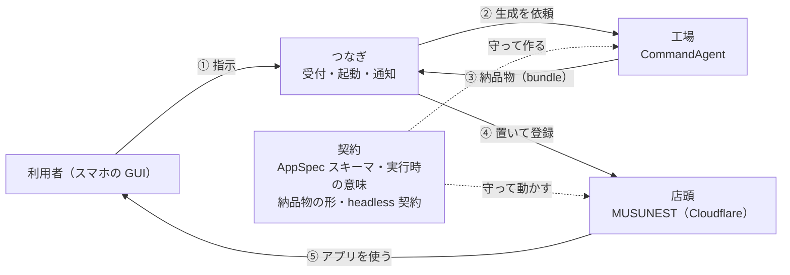
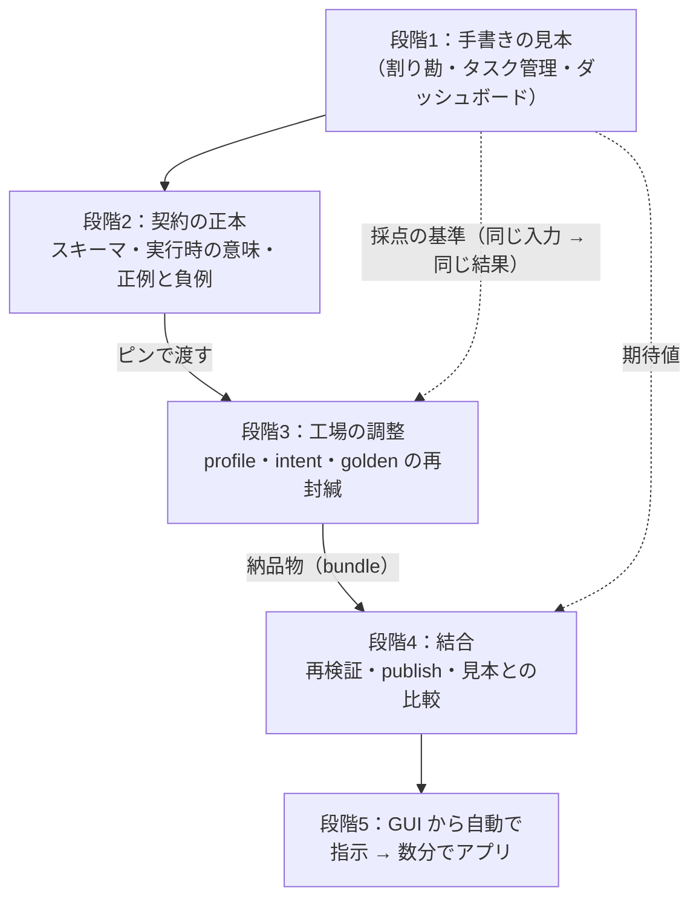

# 01：全体像と、店頭と工場をつなぐ戦略

> 状態：**決定**（2026-09-15）。D1〜D7 は所有者が決めた（§6）。**M1a と M1b のゲートは所有者が宣言した**（§5.3）。
> 宣言の具体例は [`02-l2-spec-examples.md`](./02-l2-spec-examples.md)、宣言の層構造と静的チェックの方向性は [`03-spec-layers-and-checker.md`](./03-spec-layers-and-checker.md)。
> 所有者の方針：**いきなり CommandAgent の出力を使わない。まず手書きのサンプルアプリを Cloudflare で動かし、その後に CommandAgent の profile と intent をチューニングして結合する。**
> 目指す体験は [`README.md`](./README.md) §0.1 のユーザーシナリオ。

---

## 0. 結論

- **契約を先に決めるのは店頭（MUSUNEST）である。** アプリの宣言の形（AppSpec スキーマ）はプラットフォームが正本を持つ。工場（CommandAgent）は、その契約どおりに作れるように調整される側である。
- だから進め方は **「見本を作る → 契約を固める → 工場を合わせる → つなぐ → 自動化する」** の 5 段になる。所有者の方針と同じ順番である。
- 手書きのサンプルアプリは、使い捨てではない。**「このアプリはこう動くべき」という見本であり、工場の生成物を採点する基準**になる。
- この順番に変えると、宣言済みの M1 ゲート（封緘済み golden 割り勘が動く）は、段階 4 まで進まないと判定できない。そこで **M1 を 2 つに分ける**と決めた。**M1a はこのリポジトリで完結させ、M1b で CommandAgent と結合する**（§5）。
- 見本は **割り勘・タスク管理・ダッシュボードの 3 つ**にする（§6 の D2・D3）。

---

## 1. 全体像：4 つの部品

目指す体験（GUI で指示すると数分でアプリができて、仲間と使える）は、次の 4 つの部品で成り立つ。

| 部品 | 役割 | どこにあるか | 今の状態 |
|---|---|---|---|
| **店頭** | アプリを動かす。画面を出し、データを守って保存する | このリポジトリ（Cloudflare 上の host・gateway・data-api・DO・D1・R2） | 器だけ（M0） |
| **工場** | 利用者の指示から、アプリの宣言（`app.spec.yaml`）を作って検査する | CommandAgent（Cloudflare の外） | 生成と検査は実証済み。ただし宣言の形は測定用の仮のもの（v0.1） |
| **契約** | 店頭と工場のあいだの約束。宣言の形・その意味・納品物の形・結果の受け渡し方 | このリポジトリの `packages/appspec-schema` と `pins/`（正本）、工場側はそのピンを持つ | 形の最小版（v0.1）だけ。意味は未定義 |
| **つなぎ** | 利用者の指示を工場へ渡し、できた納品物を店頭に置き、利用者に知らせる | 両方にまたがる（GUI・Queue・工場の起動・publish） | 無い |

### 1.1 「アプリのデプロイ」は何をすることか

MVP のアプリは、コードを持たない **L2** のアプリである。宣言（`app.spec.yaml`）だけでできている。M1 の 3 つの見本の宣言の具体例は [`02-l2-spec-examples.md`](./02-l2-spec-examples.md) にある。

- **アプリごとに Worker を配ることはしない。** 共通の店頭（host の Instant Renderer と data-api）が宣言を読んで、画面と処理を作る
- **アプリの「デプロイ」は、宣言を R2 に置いて、台帳（D1）に登録すること**である。ビルドが無いので速い
- だから「指示から数分」の大半は、工場が宣言を作って検査する時間になる

コードを配る形（L3 の server functions・Form B）は M5〜M6 以降の話で、MVP には出てこない。

---

## 2. つなぎ方の考え方

### 2.1 契約はプラットフォームが決める

- AppSpec スキーマは **platform-owned**（MUSUNEST が正本）である。これは CommandAgent 側の契約文書（`docs/community-mini-app-profile-contract.md`）にも書かれている
- 工場が今使っている v0.1 は、**本物のスキーマが届くまでの測定用の仮置き**である。同じ文書に「本物が届いたら封緘された差し替えの手順で入れ替える」とある
- つまり、工場は本物の契約を待っている状態である。**契約を先に作るのが店頭の仕事**になる

### 2.2 見本（サンプルアプリ）で契約を作る

契約を机の上で考えると、実際に動かしたときに足りないものが後から見つかる。そこで：

1. **手書きのサンプルアプリを、店頭で本当に動かす**（工場を使わない）
2. 動かすのに必要だった宣言の形と意味を、**そのまま契約として書き出す**
3. 契約を工場へ渡す

こうすると、契約は「店頭が実際に動かせるもの」だけで構成される。工場の生成物が契約を守っていれば、店頭で必ず動く。

### 2.3 見本は採点の基準になる

手書きのサンプルは、結合のあとも残る。

- **工場の生成物と見本に、同じ入力を入れて、同じ結果（computed の値）が出るか**を比べられる
- これが「golden の期待値」（`00-open-questions.md` の Q2）の自然な答えになる
- 工場の調整（profile・intent）の良し悪しも、この比較で測れる

---

## 3. 段階

| 段階 | 目的 | 作るもの | 主な作業場所 | 工場を使うか |
|---|---|---|---|---|
| **1. 見本を動かす** | 店頭がアプリを動かせることを示す | 手書きの見本 3 つ（割り勘・タスク管理・ダッシュボード）・スキーマの草案・評価器・静的チェックツール・API・DO の表・画面・publish | このリポジトリ | 使わない |
| **2. 契約を固める** | 見本から契約を書き出し、工場へ渡す | スキーマの正本（新しい版）・実行時の意味の文書・見本を入れた正例と負例・ピン | このリポジトリ（渡すのは CommandAgent へ） | 渡すだけ |
| **3. 工場を合わせる** | 工場が新しい契約どおりに作れるようにする | profile `community-mini-app` と intent の調整・golden スイートの再封緘（タスク管理・ダッシュボードは新しく作る）・生成物の採点 | CommandAgent | 使う |
| **4. つなぐ（連携 Lv1）** | 工場の生成物を店頭で動かし、見本と比べる | headless 契約の読み取り・納品物の再検証・生成物の publish・見本との比較 | 両方 | 使う（手で起動） |
| **5. 自動化する（連携 Lv2）** | 利用者の指示から数分でアプリを届ける | 指示の GUI・Queue・工場の起動・自動 publish・通知・同じ URL での差し替え | 両方 | 使う（自動で起動） |

### 3.1 段階 1：見本を動かす

- **何を作るか**：手書きの `app.spec.yaml` を、M1 の経路（R2 → data-api → host の画面 → DO）で staging のスマホまで通す。**割り勘 → タスク管理 → ダッシュボードの順**に 1 つずつ通す
- **ポイント**：
  - 置き方は、将来工場の納品物を置くときと**同じ形**（R2 に置いて台帳に登録）にする。見本のためだけの近道を作らない
  - 3 つとも v0.1 では書けない（精算・ボード・グラフ・entity をまたぐ集計が無い）。**足りない分は、見本を書きながらスキーマの草案として足す**（足すものの一覧は `02` §6）
  - 最初の割り勘で経路（置く → 読む → 保存する → 画面に出す）を全部通す。タスク管理とダッシュボードは、その経路に部品（`board`・`dashboard` など）と書き方を足す作業になる
  - 宣言は層（データ連携・データ・ロジック・UI・UX と権限）で考え、**静的チェックツールを最初から一緒に作る**（`03`）
- **終わりの目安**：手書きの見本 3 つが staging のスマホで動き、再読み込みしてもデータが残る

### 3.2 段階 2：契約を固める

- **何を作るか**：
  - スキーマの正本（v0.1 の次の版）を `packages/appspec-schema` に置き、SHA-256 を決める
  - 実行時の意味の文書（`list` の中身・views の描き方・actions の動き・権限など）
  - 見本を「正しい例」、わざと壊した宣言を「誤った例」として一緒に置く
- **ポイント**：割り勘だけで契約を固めると、割り勘に偏る。**3 つの見本が全部動いてから固める**（§6 の D3）。見本ごとに、契約に持ち込む書き方が違う（`02` §6）
- **終わりの目安**：契約の正本とピンが揃い、工場に渡せる

### 3.3 段階 3：工場を合わせる

- **何をするか**（CommandAgent 側の作業。このリポジトリの外）：
  - 仮のスキーマ（v0.1）を本物に差し替える儀式（CommandAgent の契約文書にある手順）
  - profile `community-mini-app` と intent（`create` など）を、新しい契約に合わせて調整する
  - golden スイートを回し、生成物を封緘し直す。今あるのは割り勘・持ち物・投票の要求文なので、**タスク管理とダッシュボードの要求文を新しく作って封緘する**
- **採点のしかた**：生成物を、段階 2 の契約で検査するだけでなく、**見本と同じ入力で同じ結果が出るか**でも測る（見本ごとの採点のシナリオは `02` の §2.3・§3.3・§4.4）
- **終わりの目安**：新しい契約で生成した 3 つのアプリが、検査に通り、見本と同じ結果を出す

### 3.4 段階 4：つなぐ（連携 Lv1）

- **何をするか**：
  - 工場の結果を headless 契約（`--summary-json` と終了コード）で読む
  - 納品物の manifest を照合し、決定的な再検証をプラットフォーム側から再現する
  - 生成物を publish し、staging のスマホで見本と並べて動かす
- **終わりの目安**：M1b のゲート（§5.3）を判定できる。宣言済みのゲート（封緘済み golden 割り勘が staging のスマホで動く）は、その中に含まれる

### 3.5 段階 5：自動化する（M2）

- **何をするか**：利用者が GUI から指示 → 工場を自動で起動 → 納品物を自動で置く → 利用者に「できました」と知らせる
- あわせて、ログイン・共有・ゲスト参加・同じ URL のままの差し替え（Progressive Delivery）が要る
- **終わりの目安**：M2 のゲート（自分たちで、指示から 2 人目が使うまで 10 分以内を連続で達成）

---

## 4. 成果物がどうつながるか

- 見本（段階 1）は、契約（段階 2）の材料になり、工場の調整（段階 3）と結合（段階 4）の採点の基準にもなる
- 契約の正本は、ずっとこのリポジトリにある。工場はピンで同じ版を持つ

---

## 5. マイルストーンへの割り当て

### 5.1 案

| 案 | M1 に入れる段階 | ゲート | 気になる点 |
|---|---|---|---|
| **A. M1 を 2 つに分ける**（**決定**） | **M1a**：段階 1〜2 ／ **M1b**：段階 3〜4 | M1a：手書きの見本 3 つが staging のスマホで動き、契約の正本とピンが揃う ／ M1b：工場で作った 3 つのアプリが動き、見本と同じ結果を出す（§5.3） | ゲートの宣言を変える（M1a を足す）。M1b は工場側の調整の期間が読めない |
| B. 段階 1〜4 を M1 のまま、期限を延ばす | 1〜4 | 宣言済みのゲートのまま | 宣言した「着手から 2 週間」を延ばすことになる。途中の進み具合が見えにくい |
| C. 宣言どおり golden を先に動かす（今の README の進め方） | 4 を先に、1〜3 は後 | 宣言済みのゲートのまま | 所有者の方針と逆の順番。v0.1 の小さな割り勘に店頭の作りが引っ張られる |

### 5.2 A にした理由

- 段階 1〜2 は、**このリポジトリだけで完結する**。進み具合を見通しやすい
- 段階 3 は **CommandAgent 側の調整**で、どれくらいかかるかが読めない。別の区切りにしたほうが、線を後から動かさずに済む
- 段階 4 のゲートは、段階 3 が終わってから期限を宣言すればよい

### 5.3 ゲート（2026-09-15 Kewton 宣言）

> 叩き台を所有者が承認し、この内容で宣言した。`../m0/05-acceptance.md` §7 の M1 ゲートの宣言は、M1b のゲートに含める形で引き継いだ（同 §7 に追記した）。
> README の §1.2 と `00-open-questions.md` に反映した（2026-09-15）。
> **同日、所有者が M1a の期限を設けないと決めた**（`00-open-questions.md` の Q10）。M1a の期限の行はそれに合わせて直した。
> **2026-09-16、所有者が時計の固定のしかたを決めた**（`00` の Q17）。M1a の判定方法 1・2 をそれに合わせて直した（下の表の後の注記）。

**M1a：このリポジトリで完結する**

| 項目 | 宣言 |
|---|---|
| ゲート | 手書きの見本 3 つ（割り勘・タスク管理・ダッシュボード）が staging のスマホで動き、契約の正本（スキーマの新しい版・実行時の意味・正例と負例）とピンが揃う |
| 判定方法 | 1. 3 つの見本の採点のシナリオ（`02` の §2.3・§3.3・§4.4）を、時計を差し込んだテスト（vitest）で流し、値が期待値と一致する（CI で機械確認）。あわせて、`deploy-staging` のあとの staging の e2e で、時計に依存しない値が期待値と一致する（機械で確認） 2. スマホ 1 台で staging の URL を開き（OS とブラウザを記録）、割り勘のシナリオを入力して「C さん → A さん 3,000 円」が出る。期限を過ぎたタスクが強調され、「完了にする」と列が移る。今日の日付で活動を記録すると「今月の活動」が増える 3. 再読み込み・別端末でもデータが残る（DO） 4. 3 つの見本がスキーマの新しい版の検査に通り、負例は落ちる（CI で機械確認） 5. staging に置かれた見本の SHA-256 が、リポジトリの見本と一致する（機械で確認） 6. スキーマの正本の SHA-256 が `pins/` に記録され、工場へ渡す値として確定している |
| 判定者 | Kewton |
| 着手日 | **2026-09-16**（M1.1 の Issue #96〜#105 と M1.2 の Issue #106〜#112 を起票した日。`00` の Q10） |
| 期限 | **設けない**（2026-09-15 所有者が決定。`00` の Q10）。着手日と合格した日は記録する。当初の宣言は「Issue を切り終えた時点で、Issue の量を見て宣言する（目安：着手から 4 週間）」 |

**M1b：CommandAgent と結合する**

| 項目 | 宣言 |
|---|---|
| ゲート | 工場（CommandAgent）が契約の新しい版で作った 3 つのアプリが staging のスマホで動き、見本と同じ採点のシナリオで同じ値を出す |
| 判定方法 | 1. 3 つの納品物を headless 契約で受け取り、verdict と assurance を記録する 2. 納品物の manifest の SHA-256 が `pins/` と一致する（機械で確認） 3. 決定的な再検証をプラットフォーム側で再現し、同じ結果になる 4. 採点のシナリオの e2e テストが、見本と生成物の両方で同じ値になる 5. スマホで生成物を開き、M1a の判定 2〜3 と同じことを確かめる |
| 判定者 | Kewton |
| 期限 | 段階 3（工場の調整）の見通しが立った時点で宣言する |

- **2026-09-16 の変更（所有者が決定。`00` の Q17）**：判定方法 1 の「e2e テストで流し（時計を固定する）」を、時計を差し込んだテストでの採点と、staging の e2e での時計に依存しない値の確認に分けた。時計を差し込む口を API に作らないためである。staging で機械では確かめない期限切れを、判定方法 2 に足した（「今月の活動」は元から入っている）
- 宣言済みの M1 ゲート（封緘済み golden 割り勘が staging のスマホで動く）は、M1b のゲートに含まれる（割り勘を 3 つに広げた形）
- 宣言済みの判定方法 5（bundle の SHA-256 が `pins/` と一致）は、M1a の 5 と M1b の 2 に引き継いだ

---

## 6. 決めること

| # | 決めること | おすすめ | 理由 | 決定（2026-09-15） |
|---|---|---|---|---|
| D1 | サンプルアプリの形 | **L2 の宣言（`app.spec.yaml`）を手で書く** | MVP のアプリは L2。GUI から数分で作る体験もビルドの無い L2 が前提。TanStack Start のアプリを手で作ると、将来の生成物と形が違って見本にならない | **おすすめどおり**（具体例 `02` を見て決定）。宣言は層で構造化し、静的チェックツールを持つ（`03`） |
| D2 | 最初のサンプル | **割り勘** | 宣言済みのゲートと同じアプリ。精算（誰が誰へ）を足すかどうかで、スキーマの草案の要否が決まる | **割り勘・タスク管理・ダッシュボードの 3 つ**（割り勘から順に通す） |
| D3 | 契約を固める前に書く見本の数 | **割り勘＋もう1つ（投票か持ち物）** | 1つだけだと契約が割り勘に偏る | **3 つ**（D2 の 3 つが全部動いてから固める） |
| D4 | 割り勘の見本に精算（誰が誰へ）を入れるか | **入れる** | 企画書の割り勘の姿であり、利用者が一番欲しい画面。v0.1 では書けないので、スキーマの草案で足す（段階 2 で工場へ渡す） | **入れる** |
| D5 | マイルストーンの分け方 | **案 A（M1a と M1b に分ける）** | §5.2 | **分ける。M1a はこのリポジトリで完結、M1b は CommandAgent との結合**。ゲートは §5.3 のとおり宣言した |
| D6 | 工場側の調整（段階 3）の作業の置き場所 | **CommandAgent のリポジトリの Issue** | 工場のコードと測定の記録はそちらにある。このリポジトリには、ピンと結合の結果だけを残す | おすすめどおり |
| D7 | 見本を置く場所 | **このリポジトリ（契約の正例として）** | 契約と見本を同じ版で管理できる。工場へはピンと一緒に渡す | おすすめどおり |

---

## 7. `00-open-questions.md` への影響

この進め方にすると、問いのいくつかは中身が変わる。**D1 とゲートの宣言のあと、`00-open-questions.md` を M1a と M1b に分けて見直した**（Q1・Q2 は解決、Q7・Q8 は M1b、Q13 を追加）。

| 問い | 影響 | 見直しの方向 |
|---|---|---|
| Q1（ゲートで使う golden） | **大** | M1a では手書きの見本 3 つを使う。golden（工場の生成物）は M1b で使い、タスク管理とダッシュボードの分は工場側で新しく作る |
| Q2（判定 3 の期待値） | **大** | 見本の採点のシナリオの値を期待値にする（§2.3・`02` の各見本の表）。精算も期待値に入る（D4） |
| Q3（v0.1 の実行時の意味） | **大** | 「v0.1 の足りない所を決める」から「見本を動かしながら次の版の契約を書く」に変わる |
| Q4（Form A の範囲・テンプレ） | 小 | L2 に絞るおすすめは変わらない |
| Q5（ログインの無い API） | なし | |
| Q6（bundle の配り方） | 小 | 見本も同じ publish で置く |
| Q7（`assurance: partial`） | 小 | M1b の話になる |
| Q8（再検証の場所） | 小 | M1b の話になる |
| Q9（ピン差し替えの儀式） | **大** | 対象が「スキーマの正本を v0.1 から新しい版へ差し替える」になり、本来の意味の差し替えになる |
| Q10（着手日） | 中 | M1a と M1b で別々に決める（§5.3） |
| Q11（リアルタイム同期） | なし | |
| Q12（spec の持ち方） | なし | |

---

## 8. リスク

| リスク | 手当て |
|---|---|
| 見本に合わせすぎて、工場が作りにくい契約になる | 段階 2 で工場側（CommandAgent の契約文書・検査の仕組み）と照らし合わせてから固める |
| 工場の調整（段階 3）が長引く | M1b として区切り、期限は段階 3 の見通しが立ってから宣言する |
| 契約の版が店頭と工場でずれる | 正本はこのリポジトリだけに置き、工場はピン（SHA-256）で持つ。ずれは照合で機械的に止める |
| 精算や集計を入れると計算が増え、CPU 10 ms に効く | M1.2 で staging の `/api` の CPU 時間を実測する（`README.md` §7.2）。見本ごとに、データが多いときも測る。線は測る前に宣言した（`../m0/06-plan-and-limits.md` §5 の P-7。`00` の Q15） |
| 見本が 3 つになり、M1a の作業が膨らむ（画面の部品だけで `list`・`table`・`settlement`・`board`・`dashboard` の 5 種類） | 割り勘で経路を全部通してから、タスク管理・ダッシュボードの部品を足す。期限は設けないので、割り勘の途中確認で進み具合を見て、残りの量を見直す |
| 時刻で変わる値（期限切れ・今月）は、採点のたびに結果が変わる | 時計を差し込んだテストで採点し、staging の e2e は時計に依存しない値だけにする（`00` の Q17）。「今日」は日本時間で数える（`00` の Q13） |
| 宣言の書き方が画面側に寄り、守りが抜ける | 守りたい条件はロジック層に書き、静的チェックで確かめる（`03` §2.2・§5） |
