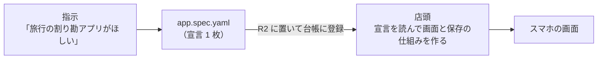

# 02：L2 の宣言の具体例（割り勘・タスク管理・ダッシュボード）

> 状態：**叩き台**（2026-09-15 作成）。D1「サンプルアプリの形」（[`01-integration-strategy.md`](./01-integration-strategy.md) §6）を決めるための具体例として書いた。所有者はこれを見て、**L2 の宣言を手で書く形に決めた**。
> 見本を 3 つ（割り勘・タスク管理・ダッシュボード）にするのも所有者の決定（同 D2・D3）。
> **YAML の書き方は、イメージを掴むための叩き台である。** 正式な形は段階 2（契約を固める）で、見本を実際に動かしながら決める。
> **この叩き台は、層構造（[`03-spec-layers-and-checker.md`](./03-spec-layers-and-checker.md)）で見直す点がある**：操作の条件（`when`）はロジック層の守りとして扱う（`03` §2.2）。精算は「計算する関数」と「見せる部品」に分ける（`03` §2.3）。

---

## 0. 一言でいうと

- **L2 のアプリは、「何を記録するか・どう計算するか・どう見せるか・誰が触れるか」を 1 枚の YAML（`app.spec.yaml`）に書いたもの**である。コードは書かない。
- 店頭（MUSUNEST）がその YAML を読んで、入力フォーム・一覧・集計・画面を作り、入力を検査して保存する。
- 近いのは、表計算ソフトで「列」と「集計の式」と「グラフ」を決める作業である。それが、そのまま仲間と使えるアプリになる。
- 工場（CommandAgent）が作るのも、この YAML 1 枚だけである。**小さいので検査しやすく、ビルドも要らない。** だから数分で届けられる。



M1a では、左端の「指示 → YAML」を人が手で書く。M1b で、そこを工場に任せる。

---

## 1. 宣言の 7 つの欄と、店頭がすること

| 欄 | 書くこと | 店頭がすること |
|---|---|---|
| `entities` | 記録するもの（支出・タスク…）と、その項目（`fields`） | 入力フォームを作る。項目の型を検査して、アプリのデータとして DO に保存する |
| `validations` | 保存してよい条件（金額は 1 円以上、など） | 保存の前に検査する。通らなければ、書いてある文言を画面に出す |
| `computed` | 自動で計算する値（1 人あたりの額、合計、件数…） | 計算して画面に出す（保存はしない） |
| `views` | 画面の種類と、そこに出す項目（一覧・表・ボード・ダッシュボード…） | 画面を作る。1 つの view が 1 つのタブになる |
| `actions` | 利用者が押せる操作（追加・直す・消す・完了にする…） | ボタンを作り、押されたら権限を確かめて実行する |
| `permissions` | 誰が読めるか・書けるか | data-api が強制する |
| `minIdentity` | 使うのに最低限必要な本人確認 | M1 はログインが無いので `anonymous`（URL を知っている人は誰でも使える。README §7.3） |

- 見本では、アプリの表示名を書く `app` 欄も足した（v0.1 には無い）
- `id`・作った日時（`createdAt`）・直した日時は、店頭が自動で付ける。宣言には書かない
- 画面の部品（一覧・ボード・グラフ…）は**店頭が用意する**。宣言は、その中から選んで項目を当てはめるだけである

---

## 2. 見本 1：割り勘

README §0.1 のユーザーシナリオと同じアプリである。

### 2.1 画面のイメージ

```text
旅行の割り勘
 [支出]  [収支]  [精算]              ← views の 3 つがタブになる
─────────────────────────
精算
  C さん → A さん   3,000 円         ← views: settlement（店頭の「精算」部品）
─────────────────────────
 ＋ 支出を入れる                     ← actions: addExpense
```

「支出を入れる」を押すと、`expense` の `fields` からフォームができる。

```text
支出を入れる
  内容        [ 夕食         ]
  金額（円）  [ 6000         ]       ← 0 以下なら「金額は 1 円以上にしてください」
  払った人    ( A さん ▼ )           ← type: ref（メンバーから 1 人選ぶ）
  割る人      [x] A  [x] B  [x] C    ← type: list（メンバーから複数選ぶ）
  [ 保存 ]
```

### 2.2 宣言

```yaml
app:
  name: 旅行の割り勘

entities:
  - name: member
    label: メンバー
    fields:
      name: { type: string, label: 名前, required: true }

  - name: expense
    label: 支出
    fields:
      description:  { type: string, label: 内容, required: true }
      amount:       { type: number, label: 金額（円）, required: true }
      payer:        { type: ref, to: member, label: 払った人, required: true }
      participants: { type: list, of: member, label: 割る人, required: true }

validations:
  - name: positiveAmount
    entity: expense
    expression: amount > 0
    message: 金額は 1 円以上にしてください
  - name: someoneShares
    entity: expense
    expression: len(participants) > 0
    message: 割る人を 1 人以上選んでください

computed:
  # 支出 1 件ごと（v0.1 と同じ書き方）
  - name: shareAmount
    entity: expense
    type: number
    expression: amount / len(participants)

  # メンバーごと（v0.1 では書けない。支出をまたいで集計する）
  - name: paid                 # 払った合計
    entity: member
    type: number
    aggregate: { sum: expense.amount, where: { payer: this } }
  - name: owed                 # 負担する合計
    entity: member
    type: number
    aggregate: { sum: expense.shareAmount, where: { participants: { contains: this } } }
  - name: balance              # 差し引き（プラスなら受け取る）
    entity: member
    type: number
    expression: paid - owed

views:
  - name: expenses
    type: list
    label: 支出
    entity: expense
    show: [description, amount, payer, shareAmount]
    sort: { by: createdAt, order: desc }
  - name: balances
    type: table
    label: 収支
    entity: member
    show: [name, paid, owed, balance]
  - name: settlement
    type: settlement           # 「誰が誰へいくら」を出す、店頭の部品
    label: 精算
    entity: member
    amount: balance

actions:
  - { name: addMember,     entity: member,  kind: create, label: メンバーを足す }
  - { name: addExpense,    entity: expense, kind: create, label: 支出を入れる }
  - { name: editExpense,   entity: expense, kind: update, label: 直す }
  - { name: deleteExpense, entity: expense, kind: delete, label: 消す }

permissions:
  - { name: read,  subject: minIdentity }
  - { name: write, subject: minIdentity }

minIdentity:
  mode: anonymous
```

**「誰が誰へいくら」は、式では書かない。** 送金の組み合わせを探す計算は、決まった形の式（ループが無い）では書けないからである。
そこで、店頭が `settlement` という部品を持ち、宣言は「メンバーごとの差し引き（`balance`）を渡す」とだけ書く。

### 2.3 採点のシナリオ（期待値）

入力：メンバー A・B・C。夕食 6,000 円（A が払い、A・B・C で割る）、タクシー 3,000 円（B が払い、A・B・C で割る）。

| 確かめるもの | 期待値 |
|---|---|
| 夕食の `shareAmount` | 2,000 |
| タクシーの `shareAmount` | 1,000 |
| A さんの `paid` / `owed` / `balance` | 6,000 / 3,000 / +3,000 |
| B さんの `paid` / `owed` / `balance` | 3,000 / 3,000 / 0 |
| C さんの `paid` / `owed` / `balance` | 0 / 3,000 / −3,000 |
| 精算 | **C さん → A さん 3,000 円**（この 1 件だけ） |

### 2.4 v0.1 から足した書き方

- アプリの表示名（`app`）を足した
- 記録するものを 2 つ（`member`・`expense`）にし、`ref` でつないだ（v0.1 の `payer` はただの文字列）
- 項目に `label`（画面の表示名）と `required` を足した
- `computed` に `aggregate`（entity をまたぐ集計）を足した。**CommandAgent の契約で「後で裁定する（QUEUED）」とされている全体参照に当たる**
- `views` に `type`（`list`・`table`・`settlement`）、`actions` に `kind`（`create`・`update`・`delete`）を足した
- `validations` に `message`、`permissions` に `write` を足した

---

## 3. 見本 2：タスク管理

旅行の準備を、3 人で分担して進めるアプリである。

### 3.1 画面のイメージ

```text
旅行の準備
 [ボード]  [一覧]  [メンバー]                 ← views
─────────────────────────
■ 未着手（1）                                 ← columns: status
  しおり作り   B さん  9/10  ⚠ 期限切れ        ← highlight: overdue
    [始める] [完了にする]                     ← actions: start・finish（when で出し分け）
■ 進行中（1）
  宿の予約     A さん  9/20
    [完了にする]
■ 完了（1）
  レンタカー   C さん  9/25
─────────────────────────
 ＋ タスクを足す
```

スマホでは、ボードの列を縦に並べる（描き方は店頭が決める）。

### 3.2 宣言

```yaml
app:
  name: 旅行の準備

entities:
  - name: member
    label: メンバー
    fields:
      name: { type: string, label: 名前, required: true }

  - name: task
    label: タスク
    fields:
      title:    { type: string, label: やること, required: true }
      status:   { type: enum, label: 状態, options: { todo: 未着手, doing: 進行中, done: 完了 }, default: todo }
      assignee: { type: ref, to: member, label: 担当 }
      due:      { type: date, label: 期限 }
      memo:     { type: string, label: メモ }

computed:
  - name: overdue              # 期限切れ（今日の日付で変わる）
    entity: task
    type: boolean
    expression: due != null and due < today() and status != "done"
  - name: openTasks            # 担当していて、終わっていないタスクの数
    entity: member
    type: number
    aggregate: { count: task, where: { assignee: this, status: { not: done } } }

views:
  - name: board
    type: board                # 状態ごとの列にカードを並べる、店頭の部品
    label: ボード
    entity: task
    columns: status
    card: [title, assignee, due]
    highlight: overdue
  - name: list
    type: list
    label: 一覧
    entity: task
    show: [title, status, assignee, due]
    filters: [assignee, status]  # 画面で「担当」「状態」で絞り込める
    sort: { by: due, order: asc }
  - name: members
    type: table
    label: メンバー
    entity: member
    show: [name, openTasks]

actions:
  - { name: addTask,    entity: task,   kind: create, label: タスクを足す }
  - { name: editTask,   entity: task,   kind: update, label: 直す }
  - { name: start,      entity: task,   kind: update, label: 始める,     set: { status: doing }, when: status == "todo" }
  - { name: finish,     entity: task,   kind: update, label: 完了にする, set: { status: done },  when: status != "done" }
  - { name: deleteTask, entity: task,   kind: delete, label: 消す }
  - { name: addMember,  entity: member, kind: create, label: メンバーを足す }

permissions:
  - { name: read,  subject: minIdentity }
  - { name: write, subject: minIdentity }

minIdentity:
  mode: anonymous
```

「自分の担当だけ見る」は、M1 では書けない。ログインが無く、「自分」が決まらないからである。
M1 は `filters` で担当者を選んで絞り込む。M2 でゲスト参加（名前を選んで参加）が入れば、選んだ名前を「自分」として使える。

### 3.3 採点のシナリオ（期待値）

時計を **2026-09-15（日本時間）に固定**する。入力：メンバー A・B・C。

| タスク | 担当 | 期限 | 状態 |
|---|---|---|---|
| 宿の予約 | A | 9/20 | 進行中 |
| しおり作り | B | 9/10 | 未着手 |
| レンタカー | C | 9/25 | 完了 |

| 確かめるもの | 期待値 |
|---|---|
| ボードの列 | 未着手：しおり作り ／ 進行中：宿の予約 ／ 完了：レンタカー |
| `overdue` | しおり作り だけ true |
| `openTasks` | A 1 ／ B 1 ／ C 0 |

続けて、しおり作りの「完了にする」を押す。

| 確かめるもの | 期待値 |
|---|---|
| ボードの列 | 未着手：なし ／ 進行中：宿の予約 ／ 完了：しおり作り・レンタカー |
| `overdue` | すべて false |
| `openTasks` | A 1 ／ B 0 ／ C 0 |
| ボタン | 完了のカードには「始める」「完了にする」が出ない |

### 3.4 割り勘に無かった書き方

- 選択肢（`enum`）と既定値（`default`）
- 日付（`date`）と、今日の日付（`today()`）
- 決まった値に書き換える操作（`set`）と、ボタンを出す条件（`when`）
- 画面の種類 `board`、絞り込み（`filters`）

---

## 4. 見本 3：ダッシュボード

### 4.1 前提：何を集計するか

**「このアプリに入れたデータを集計する」ダッシュボードにする**（2026-09-15 所有者が確認）。L2 で書けるのはこれだけだからである。

| 何を集計するか | L2 で書けるか | 扱い |
|---|---|---|
| **このアプリに入れたデータ**（決定） | 書ける | M1a の見本 |
| 同じ仲間の、別のアプリのデータ（割り勘の支出とタスクの進み具合を 1 画面に） | 書けない。アプリをまたいでデータを読む権限の設計が要る | M1 の範囲外 |
| 外のデータ（スプレッドシート、他のサービスの API） | 書けない。外との通信と鍵の管理を店頭が用意する必要がある | MVP の範囲外 |

題材は「サークルの活動記録」にした。練習や試合を記録すると、回数・参加人数・費用が集計される。

### 4.2 画面のイメージ

```text
サークルの活動
 [ダッシュボード]  [活動の記録]
─────────────────────────
 今月の活動       2 回                ← widgets: number
 今月の参加（のべ）5 人
 1 回あたりの参加  2.5 人
 今月の費用       8,000 円
─────────────────────────
 月ごとの活動回数                     ← widgets: bar
   4月 |
   5月 |
   6月 |
   7月 |
   8月 |■■ 2
   9月 |■■ 2
─────────────────────────
 種類の内訳                           ← widgets: pie
   練習 2 ・ 試合 1 ・ 飲み会 1
─────────────────────────
 参加回数                             ← widgets: ranking
   A さん 4 回
   B さん 3 回
   C さん 3 回
   D さん 1 回
```

### 4.3 宣言

```yaml
app:
  name: サークルの活動

entities:
  - name: member
    label: メンバー
    fields:
      name: { type: string, label: 名前, required: true }

  - name: activity
    label: 活動
    fields:
      date:      { type: date, label: 日付, required: true }
      kind:      { type: enum, label: 種類, options: { practice: 練習, match: 試合, party: 飲み会 }, required: true }
      attendees: { type: list, of: member, label: 参加した人 }
      cost:      { type: number, label: 費用（円） }

validations:
  - name: costNotNegative
    entity: activity
    expression: cost == null or cost >= 0
    message: 費用は 0 円以上にしてください

computed:
  # 活動 1 件ごと
  - name: attendeeCount
    entity: activity
    type: number
    expression: len(attendees)

  # メンバーごと
  - name: attendance
    entity: member
    type: number
    aggregate: { count: activity, where: { attendees: { contains: this } } }

  # アプリ全体（どの entity にも属さない集計。v0.1 では書けない）
  - name: activitiesThisMonth
    scope: app
    type: number
    aggregate: { count: activity, where: { date: { within: this_month } } }
  - name: attendeesThisMonth
    scope: app
    type: number
    aggregate: { sum: activity.attendeeCount, where: { date: { within: this_month } } }
  - name: costThisMonth
    scope: app
    type: number
    aggregate: { sum: activity.cost, where: { date: { within: this_month } } }
  - name: averageAttendees
    scope: app
    type: number
    expression: attendeesThisMonth / max(1, activitiesThisMonth)
  - name: activitiesByMonth
    scope: app
    type: groups               # 「見出しと値」の組の並び。グラフに渡す
    aggregate: { count: activity, groupBy: { month: activity.date }, last: 6 }
  - name: activitiesByKind
    scope: app
    type: groups
    aggregate: { count: activity, groupBy: activity.kind }

views:
  - name: dashboard
    type: dashboard
    label: ダッシュボード
    widgets:
      - { type: number,  label: 今月の活動,         value: activitiesThisMonth, unit: 回 }
      - { type: number,  label: 今月の参加（のべ）, value: attendeesThisMonth,  unit: 人 }
      - { type: number,  label: 1 回あたりの参加,   value: averageAttendees,    unit: 人 }
      - { type: number,  label: 今月の費用,         value: costThisMonth,       unit: 円 }
      - { type: bar,     label: 月ごとの活動回数,   value: activitiesByMonth }
      - { type: pie,     label: 種類の内訳,         value: activitiesByKind }
      - { type: ranking, label: 参加回数,           entity: member, show: [name, attendance], by: attendance, limit: 5 }
  - name: activities
    type: list
    label: 活動の記録
    entity: activity
    show: [date, kind, attendeeCount, cost]
    sort: { by: date, order: desc }

actions:
  - { name: addActivity,    entity: activity, kind: create, label: 活動を記録する }
  - { name: editActivity,   entity: activity, kind: update, label: 直す }
  - { name: deleteActivity, entity: activity, kind: delete, label: 消す }
  - { name: addMember,      entity: member,   kind: create, label: メンバーを足す }

permissions:
  - { name: read,  subject: minIdentity }
  - { name: write, subject: minIdentity }

minIdentity:
  mode: anonymous
```

### 4.4 採点のシナリオ（期待値）

時計を **2026-09-15（日本時間）に固定**する。入力：メンバー A・B・C・D。

| 日付 | 種類 | 参加した人 | 費用 |
|---|---|---|---|
| 8/27 | 練習 | A・C | 2,000 |
| 8/30 | 飲み会 | A・B・C・D | 12,000 |
| 9/3 | 練習 | A・B・C | 3,000 |
| 9/10 | 試合 | A・B | 5,000 |

| 確かめるもの | 期待値 |
|---|---|
| 今月の活動 | 2 回 |
| 今月の参加（のべ） | 5 人 |
| 1 回あたりの参加 | 2.5 人 |
| 今月の費用 | 8,000 円 |
| 月ごとの活動回数 | 4〜7 月 0 ／ 8 月 2 ／ 9 月 2 |
| 種類の内訳 | 練習 2 ／ 試合 1 ／ 飲み会 1 |
| 参加回数 | A 4 ／ B 3 ／ C 3 ／ D 1 |

時計を 2026-10-01 に進めると、「今月の活動」は 0 回になり、「月ごとの活動回数」は 5〜10 月になる。**時刻で変わる値は、時計を固定しないと採点できない。**

### 4.5 ほかの見本に無かった書き方

- アプリ全体の集計（`scope: app`）と、見出しごとの集計（`groupBy`・`groups` 型）
- 期間の条件（`within: this_month`）
- 画面の種類 `dashboard` と、その中の部品（`number`・`bar`・`pie`・`ranking`）

---

## 5. 指示を足すと、宣言はどう変わるか

README §0.1 の手順 9「支出にメモ欄を足して」は、割り勘の宣言に **1 行足すだけ**である。

```diff
   - name: expense
     label: 支出
     fields:
       description:  { type: string, label: 内容, required: true }
       amount:       { type: number, label: 金額（円）, required: true }
       payer:        { type: ref, to: member, label: 払った人, required: true }
       participants: { type: list, of: member, label: 割る人, required: true }
+      memo:         { type: string, label: メモ }
```

- 工場が直すのは、この 1 行である。店頭は、新しい宣言を同じアプリに置き直す
- 入力済みの支出は、そのまま残る（メモは空になる）
- 項目を消す・型を変えるときの扱いは、同じリンクのままの差し替え（M2 以降）で決める

---

## 6. 3 つの見本が契約に足すもの

**3 つの見本は、それぞれ違う書き方を契約に持ち込む。** 割り勘だけで契約を固めると、ボードもグラフも入らない。

| 足す書き方 | 割り勘 | タスク管理 | ダッシュボード |
|---|:---:|:---:|:---:|
| 表示名（`label`）・必須（`required`） | ○ | ○ | ○ |
| entity どうしの参照（`ref`・`list of`） | ○ | ○ | ○ |
| entity をまたぐ集計（`aggregate` の `sum`・`count`・`where`） | ○ | ○ | ○ |
| 操作の種類（`kind`） | ○ | ○ | ○ |
| 検査の文言（`message`） | ○ | | ○ |
| 選択肢（`enum`） | | ○ | ○ |
| 既定値（`default`） | | ○ | |
| 日付（`date`）と時刻に依存する値（`today()`・`this_month`） | | ○ | ○ |
| 決まった値への書き換え（`set`）・ボタンの条件（`when`） | | ○ | |
| アプリ全体の集計（`scope: app`・`groupBy`） | | | ○ |
| 画面：`list`・`table` | ○ | ○ | ○ |
| 画面：`settlement` | ○ | | |
| 画面：`board`・絞り込み（`filters`） | | ○ | |
| 画面：`dashboard`（`number`・`bar`・`pie`・`ranking`） | | | ○ |

### 6.1 見本を動かすと決めることになる「実行時の意味」

YAML の形だけでは、答えが 1 つに決まらないものがある。見本を動かすときに決め、契約の文書に書く。

| 決めること | 出てくる見本 | 例 |
|---|---|---|
| 端数 | 割り勘 | 1,000 円を 3 人で割ると 333.33… 円。1 円未満をどうするか、余りを誰が持つか。**金額は整数円に限り、余りは `settle` の中で解く**と決めた（`00` の Q18-5・Q18-6） |
| 精算の組み方 | 割り勘 | 送金の回数を最少にするか。同じ金額の人が複数いるときの順番。**一組ごとに残額で並べ直す**と決めた（`00` の Q18-7） |
| 参照先を消したとき | 割り勘・タスク管理 | 支出に名前が残っているメンバーを消せるか |
| 「今日」「今月」 | タスク管理・ダッシュボード | 日本時間で数えるか。採点では時計を固定する |
| 空のとき | 全部 | 支出が 0 件の精算、費用が空の活動の合計（0 として数えるか） |
| 同じ値の並び | ダッシュボード | 参加回数が同じ B さんと C さんの順番 |

---

## 7. L2 でできないこと

| やりたいこと | L2 で書けない理由 | どうするか |
|---|---|---|
| 外のサービスとやり取りする（天気、カレンダー、決済） | 宣言に、外と通信する欄が無い | MVP の範囲外 |
| 部品に無い画面（自由なデザイン、ゲーム） | 画面は、店頭が持つ部品から選ぶだけ | L3（M5〜M6 以降。`01` §1.1） |
| 部品に無い計算（くじ引き、複雑な割り当て） | 式は決まった形だけ（ループや乱数が無い） | よく使うものは店頭が部品として足す（精算がその例）。それ以外は L3 |

**部品を増やすのは店頭の仕事、部品を選んで組み合わせるのが工場の仕事**、という分担になる。

---

## 8. 工場（CommandAgent）から見ると

- 今の工場は、v0.1 の 7 つの欄と、`computed` の 4 つのキー（`name`・`entity`・`expression`・`type`）しか受け付けない。**それ以外のキーを書くと検査で落ちる**（語彙が閉じている）
- この文書で足した `aggregate`・`scope`・画面の `type` などは、段階 2 で契約として固め、段階 3 で工場の検査と生成の指示に足す
- 工場の golden スイートは、今は割り勘・持ち物・投票の 3 つである。**タスク管理とダッシュボードの要求文は、段階 3 で新しく作って封緘する**
- 各見本の「採点のシナリオ」は、工場の生成物にも同じ入力を入れて、同じ値が出るかを比べるのに使う（`01` §2.3）
