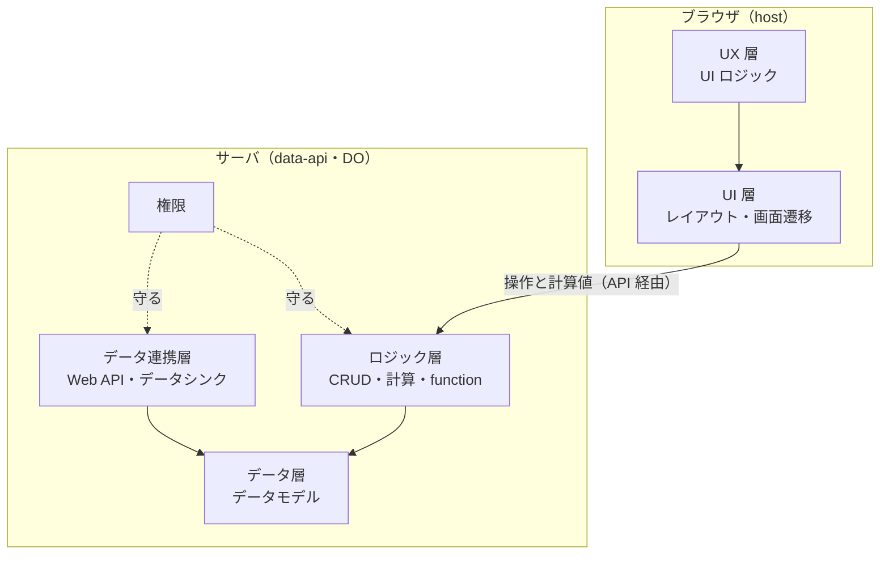

# 03：宣言の層構造と静的チェック（方向性）

> 状態：**方向性**（2026-09-15）。所有者の提案「宣言を層で構造化する」「静的チェックツールを持つ」を受けて整理した。
> **具体的な書き方と作り方は M1a で決める**（§6）。見本の宣言の具体例は [`02-l2-spec-examples.md`](./02-l2-spec-examples.md)、進め方は [`01-integration-strategy.md`](./01-integration-strategy.md)。

---

## 0. 一言でいうと

- 宣言を **5 つの層と、全層に効く権限**に分ける。層ごとに「何を決めるか」「店頭のどこで動かすか」「M1a で作るか」がはっきりする
- 層は**下の層だけを参照する**。**守らなければいけない条件は、ロジック層に書く。** 画面側（UI・UX 層）に書いた条件は、守りにならない
- **静的チェックツールを店頭が持つ。** 見本を書くとき・CI・publish の直前・工場の検査で、同じ判定を使う

---

## 1. 層

| 層 | 決めること | `02` の書き方でいうと | 動かす場所（店頭） | M1a |
|---|---|---|---|---|
| **データ連携** | 外の Web API とのやり取り、データの取り込み・書き出し（データシンク） | 無い | `packages/connector`（Connector Plane。M6 まで空） | **作らない**（層の席だけ残す） |
| **データ** | データモデル：entity・項目・型・参照・必須・既定値 | `entities` | `appspec-schema`（形）・`app-do`（DO に保存） | 作る |
| **ロジック** | CRUD、計算（computed・集計）、function、保存してよい条件、操作してよい条件 | `validations`・`computed`・`actions` | `data-api`・`spec-engine` | 作る |
| **権限**（全層に効く） | 誰が読めるか・書けるか・どの操作をできるか | `permissions`・`minIdentity` | `data-api` | `anonymous` だけ（ログインは M2） |
| **UI** | レイアウト（どの画面に何を置くか）、画面遷移 | `views` | `host`（Instant Renderer。ブラウザで動く） | 作る |
| **UX** | UI ロジック：絞り込み・並び・強調・入力の補助・削除の確認 | `filters`・`sort`・`highlight` | `host`（ブラウザ） | 一部作る |



矢印は「参照する」の向きである。**ブラウザとサーバの境目が API で、守りは必ずサーバ側で行う**（`CLAUDE.md` の「Data API が唯一の権限強制点」）。

---

## 2. 層の決まりごと

### 2.1 参照は下の層へだけ

- データ層は、ほかの層を知らない
- ロジック層は、画面の名前を使わない
- UI 層は、項目と計算値を**読んで見せ**、書き込みはロジック層の操作（`actions`）を**呼ぶだけ**にする

この向きは、静的チェックで機械的に確かめる（§5）。

### 2.2 守りたい条件は、ロジック層に書く

`02` のタスク管理の「完了にする」には、`when: status != "done"` という条件を付けた。これは**ロジック層の条件**として扱う。

- data-api が、完了済みのタスクへの「完了にする」を**断る**
- 画面は、その条件を見てボタンを**出さない**

画面でボタンを隠すだけだと、API を直接呼べば同じ操作ができてしまう。**UI・UX 層の条件は見た目の工夫であり、守りではない。**

### 2.3 計算はロジック層、見せ方は UI 層

`02` の割り勘では、`settlement` という画面の部品が「誰が誰へいくら」の**計算と表示を両方**持っていた。層に分けると、次のように直すのがよい。

- ロジック層：店頭が用意する関数 `settle`（メンバーごとの差し引きから、送金の組を出す）
- UI 層：その結果を、一覧の部品で見せる

こうすると、**精算の期待値を画面なしで採点できる**（API の値を比べるだけで済む）。工場の生成物との比較も、ロジック層の値で行える。

### 2.4 function の範囲

- **店頭が用意する関数**（今の `min`・`max`・`len` に、`sum`・`count`・`today`・`settle` などを足す）
- **宣言の中で名前を付けた式**（同じ計算を何度も使うとき）

ここまでが L2 である。利用者や工場がコードで関数を書くのは L3（M5〜M6 以降）になる。

### 2.5 データ連携層は、席だけ残す

- M1 では作らない（`02` §7 のとおり、外とのやり取りは MVP の範囲外）
- それでも**層として席を空けておく**。後から足すときに、ほかの層の書き方を変えずに済む
- 足すときの方向：外と通信するのは店頭が用意した部品だけにし、接続の鍵は店頭が持つ。**宣言に URL や鍵を書かない**

---

## 3. 層に分けると良いこと

| 良いこと | 例 |
|---|---|
| **変更の危なさが、層で分かる** | 「メモ欄を足して」は、データ層（項目を 1 つ足す）と UI 層（表示に足す）の変更である。UI・UX 層だけの変更ならデータに触れないので、同じリンクのまま安心して差し替えられる。データ層の変更は、入力済みのデータを壊さないかを確かめる |
| **工場が作りやすく、直しやすい** | 層ごとに作って検査できる。直すときも、直す層を絞れる |
| **部品を足す場所が決まる** | 精算なら、計算はロジック層の関数に、見せ方は UI 層の部品に足す（§2.3） |
| **静的チェックを層ごとに書ける** | §5 |

---

## 4. 宣言の形（イメージ）

層をそのまま、宣言の見出しにすると次のようになる。

```yaml
app: { name: 旅行の割り勘 }

integrations: []              # データ連携層（M1 では空）

data:                         # データ層
  entities: [...]

logic:                        # ロジック層
  validations: [...]
  computed: [...]
  functions: [...]            # 宣言の中で名前を付けた式
  actions: [...]

permissions: [...]            # 権限（全層に効く）
minIdentity: { mode: anonymous }

ui:                           # UI 層
  screens: [...]
  navigation: [...]

ux:                           # UX 層
  filters: [...]
  highlights: [...]
```

今の v0.1 は、7 つの見出しが横に並んでいるだけである。**層で入れ子にするか、並びのまま「どの見出しがどの層か」を契約の文書で決めるか**は、M1a の段階 2（契約を固める）で決める。どちらでも、静的チェックは層ごとに書ける。

---

## 5. 静的チェックツール

### 5.1 確かめること

| 種類 | 確かめること | 見つける誤りの例 |
|---|---|---|
| 形 | スキーマに合うか。知らない見出しや項目が無いか | `lable:`（綴りの間違い） |
| データ層 | 型が正しいか。参照先の entity があるか。名前が重ならないか | `to: menber` |
| ロジック層 | 式の型。参照先の項目があるか。循環が無いか。店頭が用意した関数だけを使っているか。式が大きすぎないか | 文字列の項目を `sum` している |
| 層の向き | 下の層から上の層を参照していないか（§2.1） | ロジック層が画面の名前を使っている |
| 守りの置き場所 | 操作の条件がロジック層にあるか（§2.2） | ボタンを隠す条件が UX 層にしか無い |
| UI・UX 層 | 表示する項目や、遷移先の画面があるか。どこからも行けない画面が無いか | `show: [memo]` なのに `memo` が無い |
| 無償枠の目安 | entity・集計・式の数が上限の内か（CPU 10 ms を守る目安。上限は M1a で実測してから決める） | 1 画面の集計が多すぎる |
| 前の版との互換 | 入力済みのデータを壊す変更が無いか | 入力済みの項目を消す・型を変える（**M2** の同じリンクのままの差し替えで使う） |

### 5.2 使う場所

| 場所 | いつ | 通らなかったら |
|---|---|---|
| 手元 | 見本の宣言を書くとき | どこが・なぜ・どう直すかを出す |
| CI | PR ごと | PR を落とす。**見本（正例）が通り、わざと壊した宣言（負例）が落ちる**ことも確かめる（M1a のゲートの判定 4） |
| publish の直前 | R2 に置く前 | **置かない**（通らない宣言は店頭に載せない） |
| 工場（M1b） | 生成物を検査するとき | 同じ正例と負例で、工場の検査と判定が揃うかを比べる |

### 5.3 作りの方針

- **式を実行せずに調べる**（深さや大きさに上限を付ける）。CommandAgent の契約文書にも同じ決まりがある
- 誤りは **3 つを組にして出す**：機械向けの誤りコード・人向けの説明・YAML の中の位置。工場は誤りコードで直し、人は説明を読む
- **チェックと実行を、同じ定義から作る。** チェックは通るのに店頭で動かない、というずれを作らない
- CommandAgent のコードは、このリポジトリに持ち込まない（`CLAUDE.md`）。**工場との判定合わせは、正例と負例をピンで渡して行う。** 工場がこのツールを直接呼ぶかは M1b で決める
- **中身は `spec-engine` に置き、手元と CI から呼ぶ入口は薄くする。** 中身が workspace のパッケージにあれば、`pnpm lint` の依存の検査が届く。publish の中身は control-plane に置き、そこから spec-engine を呼ぶ（2026-09-16 所有者が決定。`00-open-questions.md` の Q14。README §10 の M1.1）

---

## 6. M1a で決めること

| 決めること | 決める時期 |
|---|---|
| 層を宣言の形でどう表すか（入れ子か、並びのままか）（§4） | M1.1 で仮に決めて書き始め、M1.5（段階 2）で確定する（`04` §3.1） |
| 画面遷移の最小の形（タブ・詳細・フォーム・戻る） | 段階 1（割り勘を通すとき） |
| 店頭が用意する関数の一覧（`sum`・`count`・`today`・`settle` など） | 段階 1〜2 |
| 静的チェックの誤りコードの体系と、入口のコマンドの形 | M1.1（最初の Issue で）。置き場所は決定済み（中身は spec-engine。`00` の Q14） |
| 無償枠の目安の上限値 | **M1.2 は根拠つきの提案まで、確定は M1.5**（2026-09-16 所有者が決定。`00` の Q18-10）。Workers Paid へ上げる線は `../m0/06-plan-and-limits.md` §5 の P-7 |
| 前の版との互換の基準 | M2（同じリンクのままの差し替えを作るとき） |
