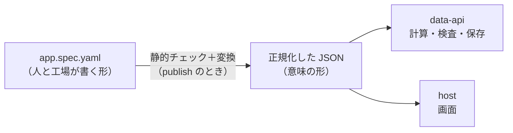

# 04：L2 の宣言の育て方

> 状態：**方針**（2026-09-15。所有者が承認）。所有者の問い「L2 の宣言はどのように組み上げて、ブラッシュアップしていくのか」への回答を整理した。
> マイルストーン（M1.1〜M1.6）の正本は [`../roadmap.md`](../roadmap.md)。宣言の具体例は [`02-l2-spec-examples.md`](./02-l2-spec-examples.md)、層と静的チェックは [`03-spec-layers-and-checker.md`](./03-spec-layers-and-checker.md)。

---

## 0. 一言でいうと

- **見本が必要とする分だけ、語彙（宣言の書き方の種類）を足す。** 最初から全部を設計しない
- 語彙を 1 つ足すたびに、**見本 → 採点のシナリオ → 型 → 静的チェック → 意味 → 実装 → スマホ**を一周させる
- **M1.5 で v0.2 に固めて工場に渡す。** その後は、工場と利用者の「書けなかった」を材料に磨く
- 語彙を増やしすぎないように、**足す条件と語彙の台帳**を持つ
- **画面は事情が違う。** 見た目と操作性の多くは、語彙を増やさずに店頭の部品を直すだけで上がる（§7）

---

## 1. 組み上げ方：マイルストーンごとに語彙を足す

| マイルストーン | 足す語彙（層） | 題材 |
|---|---|---|
| **M1.1** | **v0.1 と同じ語彙から始める**。データ：entity と項目（文字列・数値・並び） ／ ロジック：追加の操作、入力の検査、同じ entity の中の計算（`min`・`max`・`len`） ／ UI：一覧 ／ 権限：ログインなし（`anonymous`） | 支出の記録 |
| **M1.2** | データ：参照（`ref`） ／ ロジック：entity をまたぐ集計（`sum`・`count`）、精算の関数（`settle`）、直す・消す、検査の文言 ／ UI：表、精算の表示 | 割り勘 |
| **M1.3** | データ：選択肢・日付 ／ ロジック：「今日」（`today()`）、決まった値への書き換え（`set`）、操作の条件（`when`） ／ UI：ボード ／ UX：絞り込み・強調 | タスク管理 |
| **M1.4** | ロジック：アプリ全体の集計、月ごと・種類ごとの集計（`groupBy`）、期間の条件 ／ UI：ダッシュボードの部品（数値・棒・円・順位） | ダッシュボード |
| **M1.5** | **語彙は足さない。** 層の向きの検査、名前の整理、足りない負例の追加をして、v0.2 に固める | 3 つの見本と負例 |

### 1.1 M1.1 を v0.1 の語彙から始める理由

- **最初の到達点が、すでに決まっている。** v0.1 は工場（CommandAgent）の契約で意味の一部が決まっており（同じ entity の中だけの計算、`min`・`max`・`len`、循環の禁止）、迷わずに始められる
- M1.1 で一番確かめたいのは、**Worker をまたぐ経路が通るか**である（`../roadmap.md` §4.2）。語彙を小さくすれば、経路に集中できる
- v0.1 が決めていない意味は、M1.1 で次のように決めて文書に書く

| 語彙 | M1.1 での意味 |
|---|---|
| `number` / `string` | JSON の数値・文字列。`number` は有限の数だけを許す |
| `list` | 文字列の並び。空と重複は許さない |
| 種類の指定の無い `views` | その entity の一覧。各行に計算した値を並べる |
| 種類の指定の無い `actions` | その entity への 1 件の追加。入力の検査を data-api で行ってから保存する |
| `permissions` / `minIdentity` | ログインが無いので、インスタンスの URL を知っている人は誰でも読み書きできる（`README.md` §7.3） |

### 1.2 M1.2 以降の語彙は、見本の叩き台から始める

- `02` の YAML は、足す語彙の**最初の案**である
- 各マイルストーンで見本を実際に動かし、書きにくい・検査しにくい・意味が 1 つに決まらない書き方は、その場で直す
- `03` §2 の見直し点（操作の条件はロジック層の守りにする、精算は関数と表示に分ける）は、M1.2・M1.3 で反映する

---

## 2. 語彙を 1 つ足すときの一周

| 順番 | すること | 置き場所（案） |
|---|---|---|
| 1 | **見本に、使いたい形で書く**（まだ動かない） | `packages/appspec-schema/samples/` |
| 2 | **採点のシナリオ（入力と期待値）を書く** | 見本の隣に、テストで読める形で置く |
| 3 | 型に足す | `packages/appspec-schema` |
| 4 | **静的チェックに足す。** 見本が通り、わざと間違えた負例が落ちることを確かめる。誤りコードを決める | `packages/spec-engine`、負例は `samples/` の中 |
| 5 | 実行時の意味を短く書く（端数・空のとき・消すとき など） | `packages/appspec-schema` の実行時の意味の文書 |
| 6 | 動かす（計算・data-api・画面） | `packages/spec-engine`・`packages/data-api`・`apps/host` |
| 7 | 採点のシナリオが通ることを確かめ、スマホで見る | 採点は時計を差し込んだテスト（vitest）。staging では `e2e`（時計に依存しない値）とスマホ |

- **1〜5 は、動かす前にやる。** 語彙の追加を、テスト先行で進める
- 1 つの Issue で扱う語彙は、なるべく 1〜2 個にする。一周が短いほど、デモまでが近い
- 手順 4 と、手順 7 の採点は、今の unit ゲート（vitest）の中で回す。検証ゲートは増やさない（`.commandmate/verify.yaml` は人しか直せない）
- staging の `e2e` は、`deploy-staging` の貫通スモークのあとに CI で回す。時刻で変わる値は、テストで時計を差し込んで採点し、staging では機械で確かめない（`00-open-questions.md` の Q16・Q17）

---

## 3. 書き方と意味を分ける



- publish のときに、YAML を静的チェックにかけ、**正規化した JSON** に変換して R2 に置く（`00-open-questions.md` Q12 の決定）
- **data-api と画面は、JSON だけを読む。** YAML は読まない
- だから、**YAML の書き方を後から直しても、直すのは静的チェックと変換だけで済む。** data-api と画面は変わらない
- 同じ理由で、見本の YAML を読みやすく直す作業は、いつでも安全にできる

### 3.1 層の形を決める時期

- 層の形（今の横並びの 7 欄のままにするか、`data:`・`logic:`・`ui:` のように入れ子にするか。`03` §4）は、**M1.1 で仮に決めて書き始める**
- M1.2〜M1.4 で語彙が増えたときに書きにくければ、変換だけを直して形を変える
- **M1.5 で v0.2 として確定する**

---

## 4. 版の運用

| 時期 | 版 | 変え方 |
|---|---|---|
| M1.1〜M1.4 | **v0.2 の草案** | 自由に変えてよい。書き方を変えたら、見本も同じ PR で直す。工場にはまだ渡さない |
| M1.5 | **v0.2 に固める** | スキーマの SHA-256 を `pins/` に記録し、工場へ渡す（Q9） |
| M1.6 以降 | v0.3、v0.4… | 下の決まりで変える |

**v0.2 に固めたあとの決まり**

- **足すだけの変更**（新しい語彙を足す、書き方を増やす）は、ある程度たまってから次の版にまとめて工場へ渡す
  - 工場の検査は、知っている語彙しか通さない（CommandAgent の契約。閉じた語彙）。語彙を足すたびに工場側の対応が要るので、細かく渡さない
- **書き方を壊す変更**（語彙を消す、意味を変える、名前を変える）は、差し替えの手順で行う
  - 新しい版を古い版の隣に置く → 両方の見本と負例で照合する → 工場側も新しい版で確かめる → 古い版を外す → 1 コミットで記録する
- どちらの変更でも、**書いた宣言が次の版でどう変わるか**を、変換の対応表として残す（M2.4 の「同じリンクのままの差し替え」で使う）

---

## 5. 何を材料に磨くか

| いつ | 誰の目で | 見ること | 直し方の例 |
|---|---|---|---|
| M1.1〜M1.4 | **店頭** | 動かせるか。CPU 10 ms に収まるか | 集計が重い書き方に上限を付ける |
| M1.5 | **契約** | 実行しなくても、検査で白黒が付くか。意味が 1 つに決まるか | 自由な式を、決まった形の書き方に置き換える |
| M1.6 | **工場** | どの語彙で生成を間違えやすいか（検査での落ち方、修復の回数） | 間違えやすい語彙の名前や形を、分かりやすく直す |
| M2.2〜 | **利用者の指示** | **宣言で書けなかった指示の数と理由** | 足りない語彙を、次の版の候補にする |
| M2.4 | **変更** | 追加の指示で、データを壊さずに書き換えられるか | 互換の決まりと、変換の対応表を足す |
| M3 | **実コミュニティ** | 要望のうち、どの語彙が足りないか | 次の版の候補にする |

### 5.1 「書けなかった理由」は、工場がすでに記録している

工場（CommandAgent）は、L2 の宣言では書けずに一段上（コードを書く L3/L4）へ上げるとき、その理由を 3 つに分けて記録する仕組みを持っている（CommandAgent の契約。昇格の記録）。

| 理由 | 足りないもの | 見直す層 |
|---|---|---|
| 式で書けない | 書き方（集計・条件など） | ロジック層 |
| 店頭が用意する関数が無い | 関数（`settle` のようなもの） | ロジック層 |
| 画面の要件 | 画面の部品 | UI・UX 層 |

この件数を計測に出すのが #27 である。**どの層の語彙が足りないかが、数字で分かる。**

---

## 6. 語彙を増やしすぎない決まり

### 6.1 足す条件

- **見本か実際の指示が必要としていて、今の語彙では書けないとき**だけ足す
- 同じことが 2 通りで書けるなら、1 つに寄せる
- よく使う計算は、式を複雑にするより、店頭が用意する関数として足す（精算がその例。`03` §2.4）
- 足す前に、**その語彙を画面・data-api・静的チェック・工場のすべてが扱えるか**を考える。どこか 1 つでも扱えないなら、まだ足さない

### 6.2 語彙の台帳

1 行に 1 つの語彙を置き、語彙が「一周」を終えているかを機械で確かめる。

```yaml
# packages/appspec-schema/vocabulary.yaml（案）
- name: aggregate            # 語彙の名前
  layer: logic               # 層
  since: v0.2-draft（M1.2）   # 入った版とマイルストーン
  samples: [warikan]         # 使っている見本
  negatives: [aggregate-sum-of-string]   # 落ちることを確かめる負例
  check_rules: [LOGIC_AGGREGATE_TARGET_NOT_NUMBER]  # 静的チェックの誤りコード
  semantics: 実行時の意味の文書の「集計」の節
  runtime: [spec-engine, data-api]       # 動かしている場所
  factory: 未対応             # 工場が扱えるか（M1.6 で対応）
```

- **欄が 1 つでも欠けている語彙があれば、CI（今の unit テストの中）で落とす。** 語彙が増えても、見本・負例・検査・意味が置き去りにならない
- `factory` の欄は、M1.5 までは「未対応」でよい。M1.6 で工場が対応したら埋める
- 台帳は、工場へ渡す「この版で使える語彙の一覧」にもなる

---

## 7. UI と操作性の育て方

> §1〜§6 は**ロジックの語彙**の話である。画面は事情が違う。**表現力の不足を、いつも語彙の追加で解こうとしない。**

### 7.1 3 つに分ける

| 種類 | 誰が持つか | 宣言に書くか | 直すと効く範囲 |
|---|---|---|---|
| **① 店頭のデザインシステム**（余白・文字・色・状態の見せ方・操作の作法） | `apps/host` の部品 | **書かない** | **全アプリが一度に良くなる** |
| **② UI 層の語彙**（部品の種類・レイアウト） | 宣言（`views`） | 書く | そう書いたアプリだけ |
| **③ UX 層の語彙**（絞り込み・並び・強調・確認） | 宣言（`filters` など） | 書く | 同上 |

**最初に疑うのは ① である。** M1.1 の画面が素っ気ないのは L2 の制約ではなく、①にまだ手を入れていないからである。

### 7.2 語彙を増やさずに上がる品質（先にここを埋める）

部品の作り（`apps/host`）だけで直せる。**宣言は 1 文字も変わらない。**

| 操作性 | 見た目 |
|---|---|
| タップ領域を十分に取る（指で押せる大きさ） | 余白・文字サイズ・行間 |
| **送信中は二重送信を止める**（押せなくする） | 色のコントラスト（読めること） |
| **失敗しても入力値を残す**（書き直させない） | **空のときの文言**（「まだ記録がありません」） |
| **エラーを、その項目のそばに出す** | 多いときの見せ方（省略・スクロール） |
| 数値の項目では数値キーボードを出す | 読み込み中の表示 |
| 破壊的な操作の前に確認する | 360px 幅で崩れない |
| 戻る操作とスクロール位置を壊さない | ダークモード |
| 項目名・ボタンに読み上げ用の名前を付ける | アイコンだけのボタンを作らない |

- **機械で測れる分**：役割と名前（`role` / `label`）・タブ順・二重送信の抑止・CSS の規則・360px でのはみ出し（jsdom と testing-library）
- **人が見る分**：実機での表示と指の操作感（🧑 のデモ Issue）。**jsdom は layout を持たないので、幅と実際の押しやすさは機械では測れない**

### 7.3 UI 層の語彙（部品）を足す条件

`§6.1` の 4 条件に加えて、画面には次を課す。

- **データの形から選べること。** 一覧は「行」、ボードは「状態」、ダッシュボードは「集計」。**見た目の好みで部品を増やさない**
- **1 部品 1 役割。** 同じことが 2 つの部品で書けるなら、1 つに寄せる
- **部品は 4 つの状態を必ず持つ**：**空 / 多い / エラー / 権限が無い**。この 4 つを決めずに部品を足さない
- **画面は式を評価しない。** 計算値も「操作してよいか」も data-api が返した値を見せるだけ（`03` §2.3）
- 静的チェックで確かめられること：表示する項目が実在するか、遷移先の画面があるか、どこからも行けない画面が無いか（`03` §5.1）

### 7.4 UX 層（操作の補助）の規律

- **UX 層の条件は守りではない。** ボタンを隠す条件は、必ずロジック層に同じ条件を置き、**data-api が断れる**ようにする（`03` §2.2）。画面はその判定を見せるだけ
- 破壊的な操作（削除）は**確認を出す**。ただし「消せるかどうか」の判定はサーバ側（参照が残っていれば断る。Q13）
- 絞り込み・並びは、**まず画面の一時的な状態として作る**（宣言に保存しない）。保存したい要望が出てから語彙にする

### 7.5 UI の語彙の一周（`§2` の画面版）

| 順番 | すること | 置き場所 |
|---|---|---|
| 1 | **画面のイメージ**を見本に書く（`02` の形） | `02-l2-spec-examples.md` |
| 2 | **操作の筋書き**を書く（誰が・何を・何回タップして・何が変わるか。失敗の筋書きも） | 見本の隣 |
| 3 | 型に足す（`views` の種類と、その部品が要る項目） | `packages/appspec-schema` |
| 4 | 静的チェックに足す（表示項目・遷移先・どこからも行けない画面）。負例も作る | `packages/spec-engine` |
| 5 | **4 つの状態**（空・多い・エラー・権限なし）の意味を短く書く | `packages/appspec-schema/docs/semantics.md` |
| 6 | 部品を実装する。**①の品質（§7.2）を同時に満たす** | `apps/host` |
| 7 | 機械で測れる分をテストにし、**実機で人が見る** | `apps/host` の unit ／ 🧑 のデモ Issue |

### 7.6 語彙を増やさない逃げ道（L4）

宣言の部品では表せない画面（自由な描画・独自の地図表現・ゲーム）は、**L4（ブラウザの sandboxed iframe で動くウィジェット）**に逃がす。判断の線は次の 3 つ。

- **同じ形の画面が 3 つ以上のアプリで要りそうか** → 要るなら部品として店頭が持つ（L2）
- **1 つのアプリに固有の見せ方か** → L4 の候補
- **データの受け渡しと権限を、店頭が握れるか** → 握れないなら作らない

### 7.7 台帳に載せる

UI・UX の語彙も `vocabulary.yaml`（§6.2）に 1 行ずつ載せる。`layer` は `ui` / `ux`、`samples` は使っている見本、`negatives` は静的チェックが落とす例、`semantics` は **4 つの状態**を書いた節を指す。**欄が欠けたら CI で落ちる**のはロジックの語彙と同じである。

### 7.8 足りないことを数字で見る

工場（CommandAgent）が L2 で書けずに上へ上げた理由のうち、**「画面の要件」に分類された件数**が、UI の語彙が足りないことの指標である（`§5.1`・#27）。**要望の数ではなく、この記録で部品を増やす判断をする。**

---

## 8. ほかの文書との関係

| 文書 | この文書で変わること |
|---|---|
| [`../roadmap.md`](../roadmap.md) | M1.1 の中身を「v0.1 と同じ語彙」とする（入力の検査・同じ entity の中の計算を含む） |
| [`02-l2-spec-examples.md`](./02-l2-spec-examples.md) | 見本の YAML は、足す語彙の最初の案として扱う（§1.2） |
| [`03-spec-layers-and-checker.md`](./03-spec-layers-and-checker.md) §6 | 層の形は、M1.1 で仮に決め、M1.5 で確定する（§3.1） |
| [`00-open-questions.md`](./00-open-questions.md) Q9・Q12 | 版の名前（v0.2）と、正規化した JSON を置く決定を、この文書の前提にする |
| [`05-architecture.md`](./05-architecture.md) §5 | 層と実装の対応。UI・UX の語彙を足す場所は `apps/host`（§7.5） |
