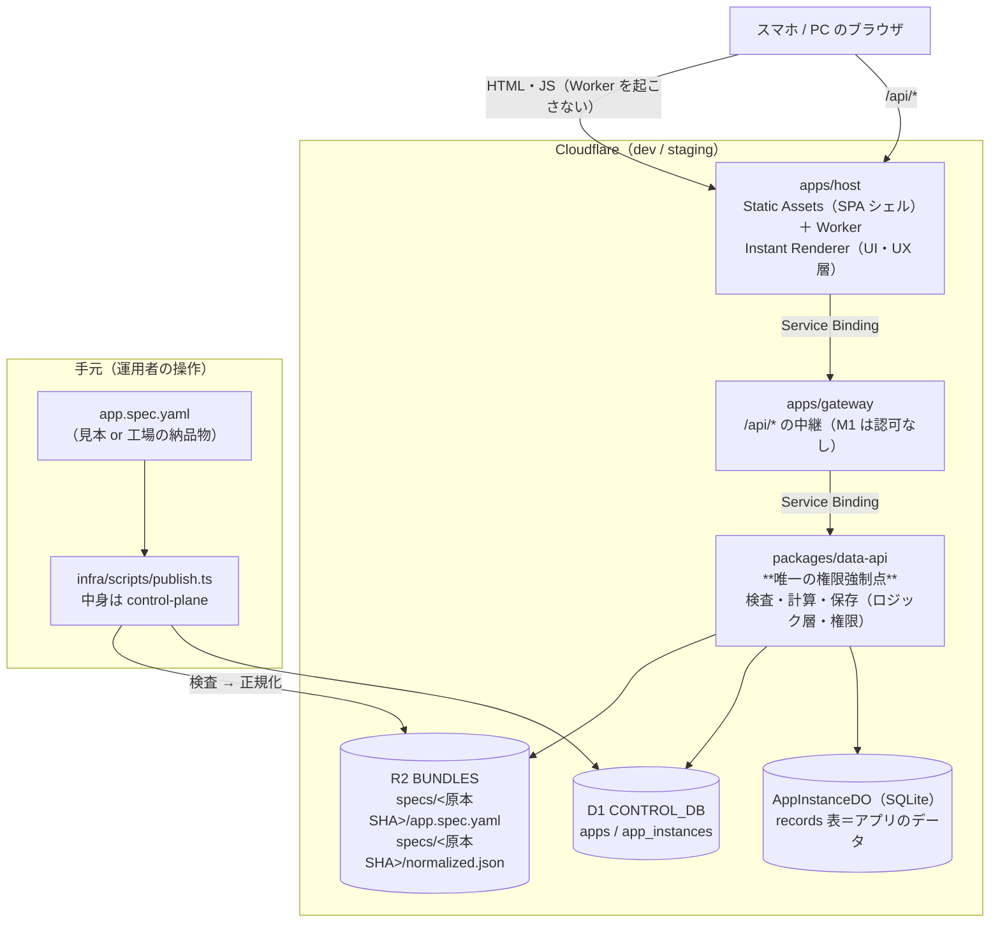
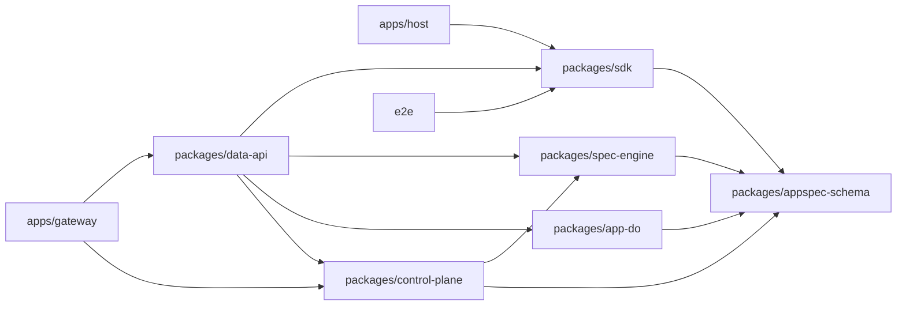
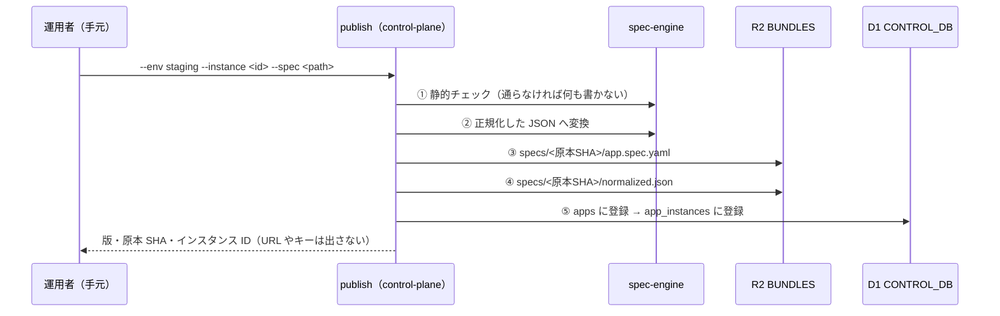
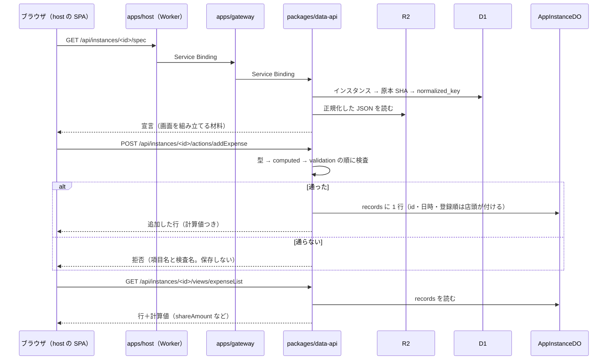
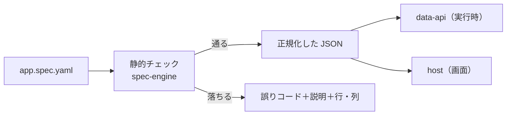

# 05：M1.1 のアーキテクチャ（実装済みの姿）

> 状態：**実装のとおり**（2026-09-17。M1.1 の #96〜#104 が merge された時点）。
> 着手前の整理は [`README.md`](./README.md)、層の考え方は [`03-spec-layers-and-checker.md`](./03-spec-layers-and-checker.md)、語彙の育て方は [`04-spec-evolution.md`](./04-spec-evolution.md)。
> **この文書はコードに合わせて直す。** 経路・表・キー・バインディング名は実装から取っている。
> staging のオリジンとアカウント ID は書かない（`CLAUDE.md`「このリポジトリは public である」）。

---

## 0. 一言でいうと

**アプリごとのコードは無い。** 宣言（`app.spec.yaml`）を R2 に置いて D1 の台帳に登録すると、共通の店頭（host・gateway・data-api）がそれを読んで、画面・検査・計算・保存を行う。

---

## 1. 配置図

- **host と gateway は R2・D1・DO に触らない**（`CLAUDE.md` の不変条件）。触るのは data-api だけ
- **画面の配信は Worker を起こさない**（Static Assets）。Worker が動くのは `/api/*` と `/healthz` だけ（`apps/host/src/worker/contract.ts` の `WORKER_ROUTES`）
- **production では host と gateway が `/api/*` を 404 にする**（下流を呼ばない。ログインが無いため。`00-open-questions.md` Q5）

---

## 2. パッケージの依存

`infra/scripts/dep-graph.mjs` が正本（`pnpm lint` が package.json と tsconfig references の両方を照合する）。

- `packages/*` は **Service Binding 経由でしか到達できない**。`data-api` が `packages/` にあるのは「外部ルートを持たせない」規律をディレクトリで表したもの
- `infra/scripts` は workspace の外。**中身を置かない**（publish の実体は control-plane）

---

## 3. 宣言を置く（publish）

| 置き場所 | 中身 |
|---|---|
| R2 のキー | `specs/<原本 SHA-256>/app.spec.yaml`（原本）と `specs/<原本 SHA-256>/normalized.json`（正規化） |
| D1 `apps` | `source_sha256`（主キー）・`schema_version`・`source_key`・`normalized_key`・`created_at` |
| D1 `app_instances` | `instance_id`（主キー）・`source_sha256`・`created_at` |

- **キーは原本 SHA から決まる**ので、同じ宣言を再 publish しても同じ場所に上書きされる（やり直しで復旧できる）
- **段の途中で失敗したら先へ進まない**（R2 のどちらかで失敗したら登録しない、D1 で失敗したら成功と報告しない）
- production は書き込みの前に断る

---

## 4. 画面を出す・1 件を追加する

- **data-api が応答するのは 4 経路**：`/healthz` と、上の 3 つ（`appspec-schema/src/api.ts` が契約の正本）
- **画面は式を評価しない。** 計算値も「操作してよいか」も data-api が返した値を見せるだけ
- DO の `records` 表は `(entity, id)` が主キー。`ordering` の連番で**登録順が安定して並ぶ**

---

## 5. 層と実装の対応

| 層（`03`） | 実装 | M1.1 で入ったもの |
|---|---|---|
| データ連携 | `packages/connector` | 空（M6 まで） |
| データ | `appspec-schema`（型）・`app-do`（保存） | entity と項目（string / number / list）、`records` 表 |
| ロジック | `spec-engine`（検査・評価）・`data-api`（強制） | 静的チェック、正規化、`min`・`max`・`len` と四則、入力の検査、1 件の追加と一覧 |
| 権限 | `data-api` | `minIdentity: anonymous` のみ（ログインは M2） |
| UI | `apps/host`（Instant Renderer） | フォームと一覧 |
| UX | `apps/host` | 最小（絞り込み・強調は M1.3） |

**守りたい条件はロジック層に書き、data-api が断る。** 画面側の条件は見た目の工夫であって守りではない。

---

## 6. 検査が通る道筋（同じ判定を 3 か所で使う）

| いつ | どこで | 落ちたら |
|---|---|---|
| 見本を書くとき | 手元の CLI（`spec-engine`） | 誤りコードと位置を出す |
| PR ごと | CI（unit の中。見本が通り、負例 24 本が落ちる） | PR を落とす |
| 置く直前 | publish | **R2 にも D1 にも書かない** |

---

## 7. M1.2 以降で増えるものを、どこに足すか

| 増えるもの | 足す場所 |
|---|---|
| 語彙（`ref`・集計・`settle`・`update`／`delete`） | `appspec-schema`（型・見本・負例・台帳）→ `spec-engine`（検査・評価）→ `data-api` → `host` の順に一周（`04` §2） |
| 画面の部品（表・精算・ボード・グラフ） | `apps/host` の Instant Renderer。**計算はロジック層へ**（`03` §2.3） |
| staging の e2e | `e2e`（`deploy-staging` の貫通スモークのあと。#110） |
| CPU の実測 | `infra/scripts/measure-free-tier.ts` を `/api` の経路へ（#111） |
| 工場の納品物 | publish の入口は同じ。取り出した宣言を同じ検査に通す（M1b） |
