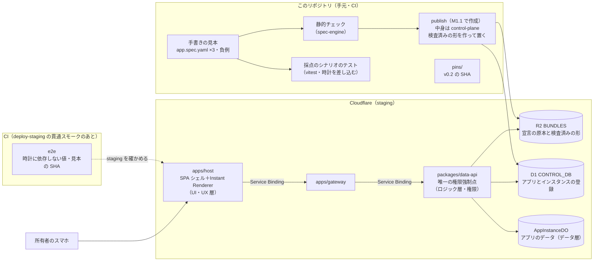

# M1：垂直スライス（M1a 見本を動かす・M1b 工場とつなぐ） — 概要

> 出典：企画書 v3.2 の 8章（表現力ラダー）／9章（アーキテクチャ）／12章（Builder Plane）／13章（テンプレート契約）／21章（リポジトリ構成）／22章（ロードマップ M1）。
> 企画書は非公開リポジトリ `Kewton/Musunest-workspace` の `proposal/` にある。**ここには章番号だけを書き、内容を引き写さない。**
> 状態：**着手（M1.1）**。着手日は **2026-09-16**（M1.1 の Issue #96〜#105 と M1.2 の Issue #106〜#112 を起票した日。Q10。`01` §5.3 に記録）。M0 は 2026-09-15 にクローズ。本書は M1 の全体像であり、手順書ではない。
>
> | 文書 | 中身 |
> |---|---|
> | [`../roadmap.md`](../roadmap.md) | **ロードマップ**（2026-09-16 決定）。M1 を M1.1〜M1.6 の「できること」に分けたマイルストーンの正本 |
> | [`00-open-questions.md`](./00-open-questions.md) | 着手前に所有者が決めること（Q1〜Q17。M1b の Q7・Q8 を除いて決定済み） |
> | [`01-integration-strategy.md`](./01-integration-strategy.md) | 進め方（見本 → 契約 → 工場 → 結合 → 自動化）と、**M1a・M1b のゲートの正本**（§5.3） |
> | [`02-l2-spec-examples.md`](./02-l2-spec-examples.md) | 見本 3 つの宣言の具体例と、採点のシナリオ（期待値） |
> | [`03-spec-layers-and-checker.md`](./03-spec-layers-and-checker.md) | 宣言の層構造と、静的チェックツールの方向性 |
> | [`04-spec-evolution.md`](./04-spec-evolution.md) | L2 の宣言の育て方（語彙の足し方・版の運用・磨く材料・語彙の台帳） |

---

## 0. 一言でいうと

この節で言いたいこと：
**M1a** で、手書きの見本 3 つ（割り勘・タスク管理・ダッシュボード）を店頭（MUSUNEST）で staging のスマホまで動かし、アプリの宣言の契約を固める。**M1b** で、工場（CommandAgent）がその契約で作ったアプリを店頭で動かし、見本と比べる。

M0 では「空の店舗」を構築した。インフラの各層（host → gateway → data-api → D1 / R2 / DO）が 3 環境すべてで疎通した状態である。
M1a では、その店舗に**手作りの商品を 3 つ並べ、商品の規格（契約）を決める**。M1b では、**工場が規格どおりに作った商品を並べる**。
なお、ログイン・Community・招待・リアルタイム同期・GUI からの自動生成は M2 の担当であり、M1 では作らない（§6 参照）。

| マイルストーン | 動くもの | 主な利用者 | 工場との接点 |
|---|---|---|---|
| M0（完了） | `/healthz` の貫通スモーク | CI | ピンの記述のみ |
| **M1a（これから）** | **手書きの見本 3 つが staging のスマホで動く** | 所有者のスマートフォン（ログインなし） | **契約（スキーマ v0.2）を固め、ピンで渡せる状態にする** |
| **M1b** | **工場が作った 3 つのアプリが動き、見本と同じ値を出す** | 同上 | **headless 契約で受け取り、再検証まで回す（連携 Lv1）** |
| M2 | 自分たちで作って共有し利用する（TTSU ≤ 10分） | 招待されたメンバー（ゲスト claim・Google OAuth） | Queue から自動生成を起動する（連携 Lv2） |

### 0.1 目指すユーザー体験（ユーザーシナリオ）

この節で言いたいこと：
**スマホの画面で「こんなアプリがほしい」と伝えると、数分でアプリができて、そのまま仲間と使える。** これが MUSUNEST の目指す体験である。M1 はその一部を作る（§0.2）。

登場人物は2人。

- **A さん**：友だち3人（A・B・C）の旅行の幹事。アプリを作る人
- **B さん**：旅行の参加者。A さんから届いたリンクでアプリを使う人

| # | 利用者がすること | 画面とシステムで起きること |
|---|---|---|
| 1 | A さんがスマホで MUSUNEST を開き、Google でログインする | ホーム画面に「アプリを作る」が出る |
| 2 | A さんが「旅行の割り勘アプリがほしい。誰が何を払ったかを入れて、最後に誰が誰へいくら払えばいいか見たい」と入力して送る | 指示が受け付けられ、工場（CommandAgent）が動き始める |
| 3 | A さんは待つ | 画面に進み具合が出る（読み取り中 → 作成中 → 検査中 → 公開中） |
| 4 | 数分後、「できました」と表示される。A さんがアプリを開く | 割り勘アプリの画面が出る。支出の一覧と「支出を追加」のボタンがある |
| 5 | A さんが「メンバーを招待」を押し、LINE で B さん・C さんにリンクを送る | 招待リンクができる（有効期限つき） |
| 6 | B さんが LINE でリンクを開き、「あなたは誰？」で自分の名前を選ぶ | ログインしなくても参加できる |
| 7 | 旅行中、A さんが「夕食 6,000 円（A・B・C）」、B さんが「タクシー 3,000 円（A・B・C）」を入力する | 入力はその場で検証されて保存される。他の人の画面にもすぐ出る |
| 8 | 旅行のあと、A さんが精算の画面を開く | 「C さん → A さんに 3,000 円」と表示される |
| 9 | A さんが「支出にメモ欄を足して」と追加で指示する | 数分後、同じリンクのままアプリが新しくなる。入力済みの支出はそのまま残る |

### 0.2 シナリオのどこを、いつ作るか

この節で言いたいこと：
M1 で作るのは、**アプリを置いて、画面を出して、入力を検証して保存する**ところ（手順 4・7・8 の中身）である。指示の GUI・自動の生成・共有・ログインは M2 で作る。

| 手順 | 必要な仕組み | いつ作るか |
|---|---|---|
| 1 | ログイン（Google OAuth） | M2 |
| 2〜3 | 指示を受け付ける GUI、工場の自動起動、進み具合の通知（連携 Lv2） | M2（M1a では手書きの見本を置く。M1b では開発者が手で工場を動かす） |
| 4 | 納品物を置いて登録する仕組み（publish）、宣言から画面を出す仕組み（Instant Renderer） | **M1a** |
| 5〜6 | 招待リンク、ゲスト参加（名前を選んで参加） | M2 |
| 7 | 入力の検証と保存（data-api・DO） | **M1a**（他の人の画面にすぐ出るリアルタイム同期は M2） |
| 8 | 精算（誰が誰へいくら） | **M1a**（見本に入れると決めた。v0.1 では書けないので、v0.2 で足す。`01-integration-strategy.md` の D4） |
| 9 | 追加の指示で作り直す仕組み、同じリンクのままの差し替え（Progressive Delivery） | M2 以降 |

- 「数分」の大半は、工場が宣言を作って検査する時間である。MVP のアプリはコードを持たない（L2）ので、店頭での「デプロイ」は R2 に置いて台帳に登録するだけで済む（`01-integration-strategy.md` §1.1）
- 手順 8 の例：夕食 6,000 円（A さんが払い、3 人で割る）とタクシー 3,000 円（B さんが払い、3 人で割る）なら、A さんは 3,000 円の受け取り、B さんは 0 円、C さんは 3,000 円の支払いになる

### 0.3 主要な用語

M1 で頻出する専門用語の意味を以下にまとめる。

| 用語 | 意味 |
|---|---|
| L2（Level 2） | 画面コードを持たず、宣言（`app.spec.yaml`）だけでできるアプリの水準。具体例は [`02-l2-spec-examples.md`](./02-l2-spec-examples.md) |
| 見本 | 人が手で書いた L2 の宣言。店頭を作る目標であり、工場の生成物を採点する基準にもなる（`01` §2.3） |
| 採点のシナリオ | 見本ごとに決めた入力と期待値（`02` の §2.3・§3.3・§4.4） |
| 契約 | 店頭と工場のあいだの約束。宣言の形（AppSpec スキーマ）・実行時の意味・納品物の形・headless 契約。正本はこのリポジトリにある |
| 層 | 宣言を、データ連携・データ・ロジック・UI・UX と、全層に効く権限に分けた構造（[`03-spec-layers-and-checker.md`](./03-spec-layers-and-checker.md)） |
| 静的チェック | 宣言を実行せずに、形・参照・型・層の向きなどを確かめること。ツールは店頭が持つ（`03` §5） |
| computed | 項目の値から、式や集計で自動的に計算する値 |
| Instant Renderer | 宣言を読んで、フォーム・一覧・ボード・ダッシュボードなどの画面をブラウザで作る仕組み（host） |
| bundle（納品物） | 工場（CommandAgent）が生成・検証した成果物一式（M1b で扱う） |
| manifest | bundle に含まれる全ファイルの SHA-256 とファイルサイズの一覧 |
| golden | 回帰テスト用に封緘された、工場の生成の要求文、またはその生成結果 |
| 封緘（ふうかん） | 成果物の SHA-256 を固定し、以降の変更を検出できるようにすること |
| ピン | 依存する外部成果物（スキーマなど）の版や SHA-256 を `pins/` で固定すること |
| headless 契約 | CommandAgent を CLI から呼び出し、JSON（`--summary-json`）と終了コードで結果を受け渡す約束 |
| verdict / assurance | 工場の判定。verdict は最終の判定（`full` 等）、assurance は検証がどこまで保証しているか（`partial` 等） |
| Service Binding | Cloudflare Workers 同士が、インターネットを経由せずに直接通信する仕組み |
| Durable Object（DO） | 個別のストレージ（SQLite）を持つ実行環境。1 アプリインスタンスに 1 つ割り当てる |

---

## 1. ゴール

この節で言いたいこと：
M1a で見本 3 つを動かして契約を固め、M1b で工場の生成物を同じ基準で動かす。

### 1.1 完了条件

企画書 22 章の M1 定義を、M1a と M1b に分けて、本リポジトリの言葉に置き換えた完了条件である。

| # | 項目 | 完了条件 | どちらで |
|---|---|---|---|
| M1-1 | ミニアプリの配信 | R2 に置いた宣言を店頭が読み、画面を作り、データが Durable Object に保存される。**手書きの見本 3 つが staging のスマホで動く** | **M1a** |
| M1-2 | 契約 | スキーマ v0.2（`community.app-spec/v0.2`）・実行時の意味の文書・正例と負例・静的チェックツールが揃い、スキーマの SHA-256 が `pins/` に記録されている。**テンプレート（`templates/tanstack-start`）の中身と、再現できる tarball の SHA-256 も `pins/` に記録されている**（#38。Q4） | **M1a** |
| M1-3 | CommandAgent 連携 Lv1 | ① headless 契約で工場の結果を読み取れる。<br>② ピン差し替えの儀式を行う（このリポジトリ側は M1a の M1-2 で行い、M1b で工場側と照合する）。<br>③ 生成 → R2 → スマホ確認までを一気通貫で通す。<br>④ 納品物の決定的な再検証をプラットフォーム側から再現する。 | **M1b** |
| M1-4 | 生成物の採点 | 工場が新しい契約で作った 3 つのアプリが、見本と同じ採点のシナリオで同じ値を出す | **M1b** |

### 1.2 ゲート（2026-09-15 Kewton 宣言）

この節で言いたいこと：
ゲートは M1a と M1b の 2 つである。**文言の正本は [`01-integration-strategy.md`](./01-integration-strategy.md) §5.3** にあり、ここは要約である。

**M1a：手書きの見本 3 つが staging のスマホで動き、契約の正本とピンが揃う**

1. 3 つの見本の採点のシナリオを、時計を差し込んだテストで流し、期待値と一致する。staging の e2e でも、時計に依存しない値が一致する（機械で確認）
2. スマホで staging を開き（OS とブラウザを記録）、割り勘の精算・期限切れの強調とタスクの列の移動・今月の活動の増加を確かめる
3. 再読み込み・別端末でもデータが残る（DO）
4. 見本が v0.2 の検査に通り、負例は落ちる（CI で機械確認）
5. staging に置かれた見本の SHA-256 が、リポジトリの見本と一致する（機械で確認）
6. スキーマの正本の SHA-256 が `pins/` に記録され、工場へ渡す値として確定している

- 判定者：Kewton
- 期限：**設けない**（2026-09-15 所有者が決定。Q10）。着手日と合格した日は記録する
- 判定 1・2 は、時計の固定のしかたの決定に合わせて 2026-09-16 に直した（Q17）

**M1b：工場が新しい契約で作った 3 つのアプリが staging のスマホで動き、見本と同じ値を出す**

- 判定方法：headless 契約での受け取り、manifest の SHA-256 の照合、再検証の再現、見本と生成物の e2e の一致、スマホでの確認
- 判定者：Kewton
- 期限：段階 3（工場の調整）の見通しが立った時点で宣言する

> M0 の受入文書（`../m0/05-acceptance.md` §7）で最初に宣言した M1 ゲート（封緘済み golden 割り勘が staging のスマホで動く）は、M1b のゲートに含まれる形で引き継いだ。

---

## 2. 何を動かすのか：見本 3 つ

この節で言いたいこと：
動かす対象は、手で書いた L2 の見本 3 つである。3 つは今のスキーマ v0.1 では書けないので、見本を動かしながら次の版 v0.2 を作る。

### 2.1 見本

宣言の全体と画面のイメージは [`02-l2-spec-examples.md`](./02-l2-spec-examples.md) にある。

| 見本 | どんなアプリか | 採点のシナリオの要点 | 契約に新しく持ち込むもの |
|---|---|---|---|
| **割り勘** | 旅行の支出を入れると、誰が誰へいくら払えばよいかが出る | 夕食 6,000 円・タクシー 3,000 円 →「C さん → A さん 3,000 円」 | メンバーをまたぐ集計、精算の関数 |
| **タスク管理** | 旅行の準備を分担し、状態ごとのボードで進める | 期限切れの判定、「完了にする」で列が移る | 選択肢・日付・「今日」、状態を書き換える操作、ボード |
| **ダッシュボード** | サークルの活動記録から、回数・参加人数・費用を集計して見せる | 今月の活動 2 回・参加 5 人・1 回あたり 2.5 人 | アプリ全体の集計、月ごとの集計、グラフ |

- **順番**：割り勘 → タスク管理 → ダッシュボード。最初の割り勘で経路（置く → 読む → 保存する → 画面に出す）を全部通し、あとの 2 つは部品と書き方を足す
- **ダッシュボードが集計するのは、そのアプリに入力したデータだけ**（2026-09-15 所有者が確認）

### 2.2 スキーマ v0.1 との関係

v0.1（`community.app-spec/v0.1`）は、工場（CommandAgent）が測定のために仮置きしているスキーマで、355 バイトと小さい。computed は同じ entity の中しか参照できず（`reference_scope: same_entity`）、組み込み関数は `min`・`max`・`len` だけである。

| v0.1 で書けること | v0.1 で書けないこと（見本に要るもの） |
|---|---|
| 1 件ごとの計算（支出 1 件の 1 人あたりの額） | entity をまたぐ集計（メンバーごとの合計、アプリ全体の件数） |
| 1 件の入力の検査（`amount > 0`） | 「誰が誰へいくら」の精算、日付と「今日」、選択肢 |
| 一覧の表示・1 件の追加 | 画面の種類（表・ボード・ダッシュボード）、書き換え・削除の操作 |

- スキーマの正本はプラットフォーム（MUSUNEST）が持つ。CommandAgent の契約文書にも、本物が届いたら封緘された手順で差し替えると書かれている
- だから M1a で **v0.1 の次の版 `community.app-spec/v0.2` をこのリポジトリで作り**、M1b で工場側を差し替える（Q9）。M1.1〜M1.4 は草案で自由に変えてよく、M1.5 で確定する（`04` §4）
- 契約に足す書き方の一覧は `02` §6 にある
- **語彙は、見本が必要とする分だけ、マイルストーンごとに足す。** 足し方と版の運用は [`04-spec-evolution.md`](./04-spec-evolution.md) にある

### 2.3 宣言の層と静的チェック

詳しくは [`03-spec-layers-and-checker.md`](./03-spec-layers-and-checker.md) にある。

- 宣言を **データ連携・データ・ロジック・UI・UX と、全層に効く権限**に分けて考える。M1a で作るのは、データ・ロジック・UI と、UX の一部である
- **守りたい条件はロジック層に書き、data-api で強制する。** 画面側（UI・UX 層）の条件は見た目の工夫であり、守りではない
- **静的チェックツールを最初から一緒に作る。** 見本を書くとき・CI・publish の直前で同じ判定を使い、M1b では工場の検査と判定を揃える

### 2.4 実行時の意味

宣言の形だけでは答えが 1 つに決まらないもの（端数・精算の組み方・「今日」の数え方・参照されているものを消すとき・空のとき・同じ値の並び）がある（`02` §6.1）。

- 見本を動かしながら MUSUNEST が決め、v0.2 と一緒に `appspec-schema` に文書で持つ（Q3）
- **すでに決めたもの**：端数・精算の組み方・「今日」・参照の削除・空・並び（Q13）と、式の上限・空 list・集計の無効値・`settle` の置き場所・整数円・`update` の方式（**Q18**）
- そのうち**利用者の画面の数字に出るもの**は、採点のシナリオの期待値に効くので、着手前に決めた（Q13。すべておすすめを採用）

### 2.5 テンプレート（#38）

テンプレートは、工場（CommandAgent）がアプリを作るときの**ひな形**である（企画書 13 章 Template as Contract）。スキーマと同じく店頭が正本を持つ契約なので、M1a で作る（Q4）。

- **中身**：変えてはいけない `core/`、使ってよい `sdk/`、工場が L3/L4 のコードを置く `app-zone/` の境界。host と同じく **SSR にしない**
- **M1a で作るもの**：`templates/tanstack-start` の中身、同じ入力から同じバイト列の tarball を作るコマンド、配布形態（GitHub Releases のアセットか R2 か）の決定、`pins/commandagent.json` の `template_tarball` の実値
- **M1 で作らないもの**：`app-zone/` に置かれたコードを店頭で動かすこと（アドオンの動的読み込み）。見本はすべて L2 だからである
- **M1b**：工場側で、測定用の合成テンプレ（`synthetic-community/`）を本物のテンプレに差し替える

---

## 3. 全体像

この節で言いたいこと：
M1a では、手書きの見本を静的チェックに通してから R2 / D1 に置き、Cloudflare 上の Worker 群を経由してスマートフォンの画面へ届ける。採点は時計を差し込んだテストで行い、staging では時計に依存しない値を e2e で確かめる。M1b では、見本の代わりに工場の納品物を同じ経路に流す。



### 3.1 M1a で通す道

1. **書く**：見本の宣言を手で書く。わざと壊した宣言（負例）も一緒に置く
2. **確かめる**：静的チェックを通す。CI では、見本が通り、負例が落ちることも確かめる
3. **置く**：
   - 手元の `publish` スクリプトが、静的チェックを通した宣言の原本と、検査済みの形（JSON）を R2 に置く
   - D1 に、アプリ（宣言の SHA-256）とインスタンスを登録する
   - 中身（静的チェック → 正規化 → 登録する行）は control-plane に置き、`infra/scripts` は資格情報と書き込みを扱う薄い呼び出しにする（Q14）。手元から R2 / D1 に書くのは運用者の操作で、リクエスト経路の規律には触れない（Q6）
4. **開く**：
   - スマートフォンから host の `/apps/<インスタンス>` を開く
   - SPA シェル（Static Assets）から画面が返る。**SSR は行わない**
5. **読む・書く**：
   - 画面が `/api/...` を呼ぶ。host の Worker が gateway へ中継し、data-api が D1 の登録をもとに R2 の宣言を引く
   - data-api が、入力の検査・操作してよいかの判定・DO への保存・computed と集計の計算を行い、結果を画面に返す
   - **画面は式を評価しない。** 計算値と「操作できるか」は data-api が返し、画面はそれを見せる
   - host および gateway は R2・D1・DO に直接触れない
   - **production では `/api/*` を 404 にする**（ログインが無いため。Q5）
6. **残る**：画面の再読み込みや別端末からのアクセスでも、同じインスタンスの DO から同じデータが返る
7. **採点する**：
   - 採点のシナリオは、時計を差し込んだテスト（vitest）で流す。spec-engine と data-api は時計を引数で受け取り、API に時計を書き換える入口は作らない（Q17）
   - staging の e2e は、`deploy-staging` の貫通スモークのあとに CI で回し、時計に依存しない値と、staging に置かれた見本の SHA-256 を確かめる（Q16）

### 3.2 M1b で足す道

1. 手元で CommandAgent を動かし、新しい契約で 3 つのアプリの納品物（bundle）を作る
2. headless 契約（`--summary-json` と終了コード）で結果を読み、verdict と assurance を確かめる
3. manifest を照合し、決定的な再検証を再現する
4. 納品物から宣言を取り出し、**M1a と同じ静的チェックと publish に渡す**
5. 同じ採点のシナリオで、見本と生成物の値を比べる

---

## 4. M0 から引き継ぐもの・M1a で足すもの

この節で言いたいこと：
M0 の疎通基盤の上に、宣言の検査・計算・保存・画面の生成と、静的チェックツールを作る。

| 対象領域 | M0 の状態 | M1a で要るもの | 層 |
|---|---|---|---|
| `packages/appspec-schema` | バージョン定数のみ（`APPSPEC_SCHEMA_VERSION = "0.0.0-m0"`） | v0.2（M1.1〜M1.4 は草案、M1.5 で正本）、型定義、実行時の意味の文書、層の定義、語彙の台帳（`vocabulary.yaml`。`04` §6.2）。`APPSPEC_SCHEMA_VERSION` を v0.2 の表記に揃える（Q9） | 全体 |
| `packages/spec-engine` | 中身なし | **静的チェック**（形・データ層・ロジック層の式・層の向き・守りの置き場所・画面の参照・上限。誤りコードつき）、YAML から正規化した JSON への変換（`04` §3。Q12）、式・集計・店頭が用意する関数（`sum`・`count`・`today`・`settle` など）の評価。**評価の前に静的チェックを通す**。時計は引数で受け取る（Q17） | データ・ロジック |
| 静的チェックの入口 | 無い | 手元・CI から呼ぶ薄いコマンド。中身は spec-engine（Q14。コマンドの形は M1.1 の最初の Issue で決める） | — |
| `packages/app-do` | healthz 用の `kv` 表のみ | 宣言の entity のレコードを持つ表。1 インスタンス 1 DO（クラス名 `AppInstanceDO` は変えない） | データ |
| `packages/control-plane` | メタ表（`_musunest_meta`）のみ | アプリ（宣言の SHA-256）とインスタンスを登録する D1 マイグレーション（前方互換の規律どおり）、登録表の読み書きの関数、publish の中身（静的チェック → 正規化 → 登録する行。Q14） | — |
| `packages/data-api` | `/healthz` のみ | 宣言の取得（R2）、登録の参照（control-plane の関数）、レコードの作成・一覧・更新・削除（検査と操作の条件つき）、computed と集計の計算、「操作できるか」の判定を返す API。時計は引数で受け取る（Q17） | ロジック・権限 |
| `apps/gateway` | `/healthz` の中継のみ | `/api/...` の中継（M1 は認可なし。M2 で AppGrant 検査を追加）。production では 404（Q5） | — |
| `apps/host` | `/api/*` は 404 応答 | `/api/*` の中継（production では 404 のまま。Q5）、**Instant Renderer**（フォーム、`list`・`table`・精算・`board`・`dashboard` の部品、最小の画面遷移）、UX の部品（絞り込み・強調・削除の確認） | UI・UX |
| `packages/sdk` | 中身なし | host から data-api を呼ぶ型付きクライアント（e2e からも使う。Q14） | — |
| 見本 | 無い | 見本 3 つの宣言と負例、採点のシナリオ（このリポジトリに置く。D7。置き場所は `packages/appspec-schema/samples/`。`04` §2 の案） | — |
| `e2e` | 中身なし | staging の e2e（`deploy-staging` の貫通スモークのあとに CI で回す。時計に依存しない値と、staging に置かれた見本の SHA-256 の照合。Q16）。時刻で変わる値の採点は、各パッケージのテストで時計を差し込んで行う（Q17） | — |
| `pins/commandagent.json` | スキーマは v0.1（工場の仮置き）。テンプレの tarball は null（#38） | スキーマのピンを、このリポジトリの v0.2 へ差し替える（Q9。M1.5）。テンプレの tarball の実値を入れる（#38。M1.5） | — |
| `packages/connector` | 中身なし（M6 まで空） | 触らない（データ連携層は M1 で作らない） | データ連携 |
| `templates/tanstack-start` | README のみ | テンプレートの中身（`core/`・`sdk/`・`app-zone/` の境界。SSR にしない）と、再現できる tarball を作るコマンド（§2.5。#38） | — |
| `infra/scripts` | deploy・smoke・計測 | `publish` の薄い呼び出し（資格情報と R2 / D1 への書き込み。中身は control-plane。Q14）、`measure-free-tier.ts` を `/api` の経路に広げる | — |
| 計測 | health chain の CPU 時間 | `/api` の経路（宣言の読み込み・計算・集計）の CPU 時間を staging で実測し、P-7 で判定する（M1.2。§7.2） | — |

- **依存の向き**：M1.1 に合わせて、`infra/scripts/dep-graph.mjs` に 3 本足した（2026-09-16 所有者が決定。Q14）。`data-api → control-plane`（D1 の登録表）、`control-plane → spec-engine`（publish の中身）、`e2e → sdk`。host は `sdk` だけを参照する。`infra/scripts` は pnpm workspace の外で依存の検査が届かないので、中身を置かない（`CLAUDE.md`）
- **計算はサーバ側**：host は `spec-engine` に依存できない。だから計算値と「操作できるか」は data-api が返し、画面は見せるだけにする。これは層の決まり（`03` §2.2・§2.3）とも合う
- **CPU 時間の実測**：`../m0/06-plan-and-limits.md` §4.1 からの持ち越し課題である。M1.2 で staging の `/api` の経路を測り、測る前に宣言した線（P-7）で判定する（§7.2）

---

## 5. M1b：CommandAgent 連携 Lv1

この節で言いたいこと：
CommandAgent のコードは取り込まず、headless 契約（JSON 出力）とピン（SHA-256 の固定）の 2 点だけでつなぐ。M1b の Issue は、M1a のゲートに合格してから切る。

### 5.1 やること

| # | 項目 | 本リポジトリで行うこと | 工場側・人の作業 |
|---|---|---|---|
| ① | headless 契約の疎通 | `--summary-json` の最終行（`commandagent.headless-summary/v1`）を読む薄い部品を作る | 手元で CommandAgent を動かす（API キー等は手元に置く） |
| ② | ピン差し替えの儀式 | このリポジトリ側は M1a で行う（スキーマのピンを v0.2 へ。Q9。テンプレの tarball のピンも M1a で入れる）。M1b では、工場が同じ版のピンを持っていることを照合する | 工場側の差し替えの儀式（スキーマと、合成テンプレから本物のテンプレへ）を、CommandAgent のリポジトリの Issue で行う（D6） |
| ③ | 生成の導通 | 工場が作った 3 つのアプリを staging に publish し、採点のシナリオで見本と比べる | 生成を実行する。タスク管理とダッシュボードの要求文は、工場側で新しく作って封緘する |
| ④ | 決定的な再検証の再現 | manifest を照合し、ピンした版の CommandAgent の offline verifier を呼んで、結果が bundle の `reverification.json` と一致することを確かめる | 実行環境を決める（Q8） |

- **判定基準**：終了コードだけで合否を決めない。必ず `verdict` と `assurance` の両方を確認する（Q7）
- **工場の調整**（profile `community-mini-app` と intent、golden の再封緘）は、CommandAgent のリポジトリで行う（D6）。このリポジトリには、ピンと結合の結果だけを残す

### 5.2 v0.1 時点の封緘済み納品物（記録）

進め方を変える前は、この納品物を M1 のゲートに使う予定だった。**今の M1a・M1b のゲートには使わない**（Q1）。v0.1 と v0.2 の違いを確かめる材料として、記録を残す。

| 項目 | 値 |
|---|---|
| 配置場所 | `workspace/management/runs/cm4-delivery-bundle-001/bundle/`（CommandAgent 側。`pins/commandagent.json` の revision `031ec74`） |
| 形式 | `commandagent.community-delivery-bundle/v1` |
| 由来 | 封緘済みスイート `community-golden-warikan`（要求文 3 種。`community-golden.sha256sums` で封緘）から 1 回の生成（修復 0 回） |
| 成果物の水準 | **L2**（`app.spec.yaml` のみ。画面コード `app-zone/` は含まない） |
| 検証結果 | S（spec）pass、Z（境界）pass（B は L2 のため対象外）。再検証 2 回で同一バイト・同一 verdict |
| headless 判定 | `verdict: full`、**`assurance: partial`** |
| スキーマ | `community.app-spec/v0.1`（SHA-256 は `pins/commandagent.json` の `appspec_schema.sha256` と一致: `80e4cb41…`） |
| manifest SHA-256 | `9e0865ea86a35070d7f3e6b87d615aaf2ac6c9f80aec7cb5958b2c6ed8eefdb8` |

中身（`artifacts/app.spec.yaml`。原本はブロック形式。ここではフロー形式で掲載した）：

```yaml
entities:
  - name: expense
    fields: { amount: number, payer: string, participants: list, description: string }
views:       [{ name: expenseList, entity: expense }]
actions:     [{ name: addExpense, entity: expense }]
validations: [{ name: positiveAmount, entity: expense, expression: amount > 0 }]
computed:
  - { name: shareAmount,      entity: expense, expression: amount / len(participants), type: number }
  - { name: netBalance,       entity: expense, expression: amount - shareAmount,       type: number }
  - { name: settlementAmount, entity: expense, expression: max(0, netBalance),         type: number }
permissions: [{ name: read, subject: minIdentity }]
minIdentity: { mode: anonymous }
```

- 支出 1 件ごとの計算だけで、支出をまたぐ精算は無い。見本の割り勘（`02` §2.2）と比べると、v0.1 で足りないものが分かる
- `assurance: partial` は、CommandAgent の契約に基づく正規のラベルである。L2 の「full」は「spec の検証は完了した。実行時のスモークはプラットフォーム統合側が受け持つ」という意味で、工場側では画面を動かしていない

---

## 6. M1 で作らないもの

この節で言いたいこと：
M1 は「宣言から、店頭でアプリを動かす」ことに専念し、認証・リアルタイム同期・自動化・外とのデータ連携は見送る。

| 作らないもの | 理由・対応予定 |
|---|---|
| ログイン（Google OAuth）、ゲスト claim、Community、招待リンク、AppGrant 認可 | M2 で作る |
| リアルタイム同期（DO の WebSocket 接続） | M2 で作る（M1 は再読み込みでデータが残れば足りる。Q11） |
| GUI からの指示、Queue による自動生成、修復枯渇時の昇格（連携 Lv2）、同じリンクのままの差し替え（Progressive Delivery） | M2 で作る |
| 前の版との互換チェック（静的チェックのうち） | M2 で作る（差し替えを作るときに使う。`03` §6） |
| TTSU ファネル計測、帰属分類ログなどの計測基盤 | M2 で作る |
| データ連携層（外の Web API・データシンク） | `packages/connector`（M6 まで空）。`03` §2.5 |
| アプリをまたぐ集計（別のアプリのデータを 1 画面に出す） | M1 の範囲外（`02` §4.1） |
| L3（server functions / WfP）、L4（sandboxed iframe UI） | L3 は M5〜M6 まで使わない（`../m0/06-plan-and-limits.md` §3）。L4 は必要時に検討する |
| テンプレの `app-zone/` に置かれたコードを店頭で動かすこと（アドオンの動的読み込み） | 見本はすべて L2 なので M1 では作らない。テンプレそのものは M1a で作る（§2.5。Q4） |
| production 環境でのミニアプリ公開 | M2 以降（認証機能の導入後。Q5） |

---

## 7. 守る制約

この節で言いたいこと：
開発規律（CLAUDE.md）、無償枠の制限、未認証状態における運用の規約を守る。

### 7.1 不変条件（`CLAUDE.md`）

- **Data API が唯一の権限強制点である**：入力の検査、操作してよいかの判定、computed と集計の計算、データの保存はすべて data-api で行う。画面側の検査は補助にすぎない。**守りたい条件は宣言のロジック層に書く**（`03` §2.2）
- **直接アクセスの禁止**：host および gateway から D1・R2・DO に直接触れない。宣言も data-api 経由で取得する
- **ストレージの分離**：D1 は Control Plane 専用（アプリ・インスタンスの登録）とする。**アプリのデータはすべて DO に保存する**
- **リポジトリ境界の維持**：CommandAgent のコードを持ち込まない。接点は headless 契約と `pins/` のみとする。工場との判定合わせも、正例と負例をピンで渡して行う（`03` §5.3）
- **環境制約の遵守**：host は SSR にしない。Workers for Platforms、Logpush、`schedule:` トリガーは使わない
- **WfP が要らないことの再確認**（M0 で「M1 着手時に再確認する」とした境界。`../m0/00-human-tasks.md`）：見本の `actions` は宣言に書いた操作で、data-api が実行する。コードの actions（WfP の isolated function）ではないので、M1 でも WfP は要らない

### 7.2 無償枠（`../m0/06-plan-and-limits.md`）

- **CPU 時間の上限は 1 起動あたり 10 ms である**：
  - 毎回 YAML をパースして静的チェックを行うと、10 ms を超えるリスクがある。publish の時点で検査済みの形を作って置く（Q12）
  - 集計（合計・件数・月ごと）は、レコード数に応じて CPU を使う。見本ごとにデータが多いときも実測し、上限の目安を静的チェックに入れる（`03` §5.1）
- **M0 の実測**（`../m0/06-plan-and-limits.md` §8）：
  - production の初回デプロイ直後の 1 回で、data-api が単体で 11.30 ms（エラーなし）。2026-09-15 に所有者が「昇格しない」と判断した
  - 落ち着いた状態の `/healthz` では、Worker 単体の最大が 5.20 ms（余裕 4.80 ms）、3 Worker の最大の和が 9.36 ms（合算なら余裕 0.64 ms）
  - 上限を Worker ごとに判定するか合算するかは、まだ分かっていない（同 §7 #1）
- **M1 の判定の線**（測る前に宣言した。2026-09-16 所有者が決定。Q15）：
  - M1.2 で staging の `/api` の経路を測る。落ち着いた状態で Worker 単体の最大が 7 ms を超えたら（余裕 3 ms 未満）、**P-7** として議論せず Workers Paid（$5）へ上げる
  - CPU 超過のエラー（`exceededResources`）が 7 日で 1 件でも出たら、**P-1** として同じく上げる
  - どちらの場合も、構成（host → gateway → data-api）は崩さない

### 7.3 ログインが無いこと

- M1 のアプリは誰でも読み書き可能な状態である（`minIdentity.mode: anonymous` をそのまま適用）
- staging の URL は非公開のサブドメインだが、秘密情報ではない
- **この認証なしの状態のまま production 環境へ公開してはならない**（Q5）

### 7.4 公開リポジトリ

- 企画書を参照する際は、内容を引き写さず章番号のみを記載する
- golden の bundle と CommandAgent のドキュメントは公開リポジトリにあるため、パスや SHA-256 を記載してよい
- 工場側の API キー、ローカルモデルの設定、生成費用の明細などは本リポジトリに置かない

---

## 8. リスク

この節で言いたいこと：
M1a の作業量、契約のずれ、CPU、未認証 API、時刻に依存する採点などのリスクを把握し、事前に手当てする。

| # | リスク | 発生時の影響 | 事前・事後の手当て |
|---|---|---|---|
| R-1 | 見本が 3 つとテンプレートで、M1a の作業が膨らむ（画面の部品 5 種類・集計・静的チェック・テンプレート） | M1a がいつまでも終わらない | 割り勘で経路を全部通してから、タスク管理・ダッシュボードの部品を足す（§10）。期限は設けないので、マイルストーンごとのデモと振り返り（とくに M1.2 の終わりの途中確認）で進み具合を見て、残りの量を見直す |
| R-2 | 見本に合わせすぎて、工場が作りにくい契約になる | M1b で工場の調整が長引く | 段階 2 で、工場側の契約文書と検査の仕組みに照らしてから固める |
| R-3 | 処理時間が CPU 10 ms の上限を超える（§7.2） | 利用者の画面がエラーになる。M0 の実測で、合算なら余裕は 0.64 ms しかない | M1.2 で `/api` の CPU 時間を実測する。P-7（Worker 単体の最大が 7 ms 超）か P-1（CPU 超過のエラー）に触れたら、議論せず $5 プランへ上げる（Q15） |
| R-4 | 認証なしの API が production に露出する（§7.3） | 誰でも production の DO にデータを書き込めてしまう | production では host・gateway とも `/api/*` を 404 にする（Q5）。M1.1 の中継と同じ Issue で入れ、テストで固定する |
| R-5 | 時刻で変わる値（期限切れ・今月）の採点が、実行のたびに変わる | 採点が不安定になり、ゲート判定 1 が揺れる | 時計を差し込んだテストで採点し、staging の e2e は時計に依存しない値だけにする（Q17）。「今日」は日本時間で数える（Q13） |
| R-6 | 契約の版が、店頭と工場でずれる（M1a から M1b までの間、工場は v0.1 のまま） | 工場の生成物が店頭の検査に通らない | 正本はこのリポジトリだけに置き、工場はピン（SHA-256）で持つ。ずれは照合で機械的に止める。M1b で工場側の差し替えを行う |
| R-7 | 工場の調整（段階 3）が長引く | M1b が終わらない | M1b として区切り、期限は段階 3 の見通しが立ってから宣言する |
| R-8 | orchestrate の実行契約の制約（goal は 8000 文字まで。ソース約 30 本が目安。`.tf`・`.gitignore`・ディレクトリの移動は scope に載らない）に抵触する | 大きすぎる Issue を自動 dispatch できない | §10.1 の基準で**分割する**。分けられないときだけ人に判断を委ねる |
| R-9 | 期限が無いので、途中で範囲が広がっても止まる点が無い | M1a に M2 の作業が入り込み、ゲートの判定が遅れる | 範囲を足すときは Issue を立てて所有者が決める。着手日と合格した日を記録し、清算で振り返る |
| R-10 | テンプレートの中身を決めるときに、L3/L4 の実行の設計まで先取りしてしまう | M1a の作業が膨らむ | M1a では境界（`core/`・`sdk/`・`app-zone/`）と tarball とピンまでにし、コードを動かす仕組みは作らない（§2.5） |

---

## 9. 人の作業（🧑）

この節で言いたいこと：
着手前・実装中・検収時の各段階で、所有者本人が行う判断と作業を明確にする。

| タイミング | 作業内容 |
|---|---|
| M1a の着手前 | `00-open-questions.md` の M1a の問いに答える（2026-09-15 済み）。<br>M1.1 の前の問い（Q14〜Q17）に答え、ロードマップを決定にする（2026-09-16 済み）。<br>着手日を記録する（2026-09-16 済み。`01` §5.3） |
| M1.1〜M1.5 のそれぞれの終わり | スマホでデモを見て、何がうまくいき何を学んだかを 5 行で残す。完了日を記録し、次のマイルストーンの Issue を切る（`../roadmap.md` §1） |
| M1a の実装中 | M1.2 の終わり（割り勘が staging で動いた時点）で、残りの量を見直す（中間の区切り。Q10）。<br>利用者に見える計算の決めごとを変えるときは承認する（Q13）。<br>CPU 時間が P-7・P-1 に触れたら、議論せず Workers Paid へ上げる（Q15）。<br>スキーマのピンの差し替えを承認する（Q9。M1.5）。<br>テンプレートの配布形態（GitHub Releases のアセットか R2 か）を決める（#38。M1.5） |
| M1a の検収時 | 実機のスマートフォンでゲート判定 2〜3 を実施し、結果を記録する。<br>清算表を記入する |
| M1b の着手前 | CommandAgent のリポジトリに、工場の調整の Issue を立てる（D6）。<br>段階 3 の見通しが立ったら、**M1b の期限を宣言する** |
| M1b の実装中 | 工場で生成を実行する（§5.1 ③）。<br>手元で再検証を実行する（§5.1 ④。Q8） |

---

## 10. Issue の切り出し方針（M1.1・M1.2）

この節で言いたいこと：
Issue は、ロードマップのマイルストーンごとに「今（M1.1）」と「次（M1.2）」の分だけ切る。1 つの Issue は 1 パッケージ前後にし、語彙を足す Issue は 1〜2 語彙で「一周」させる。

> ロードマップ（[`../roadmap.md`](../roadmap.md) §1・§3）の決まりに従う。**M1.3 以降は、M1.2 の Issue を切るときに「次」として切る。** GitHub の Milestone は「M1.1 宣言からフォームと一覧が出る」のように作ってある（同 §8）。

### 10.1 分割の基準

- **マイルストーンの「できること」で区切る。** パッケージごとの作業は、マイルストーンの中での Issue の並び（依存の順）で表す
- 1 Issue あたり 1 パッケージ前後、ソースコード 30 本程度までにする。orchestrate の実行契約は goal が 8000 文字までで、`.tf`・`.gitignore`・ディレクトリの移動は scope に載らない。**原則は Issue を分割して dispatch できる形にする。** どうしても分けられないときだけ、人に判断を委ねる（`CLAUDE.md`「開発の進め方」）
- 語彙を足す Issue は 1〜2 語彙にし、`04` §2 の一周（見本 → 採点のシナリオ → 型 → 静的チェック → 意味 → 実装 → スマホ）を回す
- **Issue 本文は planner が読める形で書く**（`## 対象ファイル` に書いてよいパスだけ、`## 依存` は素の番号だけ、地の文にパスを書かない）。`CLAUDE.md`「Issue の書き方」と [`../../../docs/parallel-development.md`](../../../docs/parallel-development.md) §7
- 依存の向きは `infra/scripts/dep-graph.mjs` の許可のとおりにする（2026-09-16 に 3 本足した。Q14）。中身を `infra/scripts` に置かない

### 10.2 M1.1 宣言からフォームと一覧が出る（今）

語彙は **v0.1 と同じ**にする（`04` §1.1）。デモ：支出を 2 件入れると一覧に出て、1 人あたりの額が出る。再読み込みしても、PC で開いても残っている。

| 順 | 対象 | 中身 |
|---|---|---|
| 1 | `appspec-schema` | v0.2 の草案の型（v0.1 と同じ語彙）、層の形の仮決め（`04` §3.1）、`APPSPEC_SCHEMA_VERSION` を v0.2 の表記に揃える（Q9）、語彙の台帳（`04` §6.2）、見本「支出の記録」と負例と採点のシナリオ、M1.1 での意味の文書（`04` §1.1） |
| 2 | `spec-engine` | 静的チェック（形・データ層・ロジック層の式。誤りコードつき）と入口のコマンド、YAML から正規化した JSON への変換（Q12）、同じ entity の中の計算の評価。時計は引数で受け取る（Q17） |
| 2 | `app-do` | 宣言の entity のレコードを持つ表（1 インスタンス 1 DO） |
| 2 | `control-plane` | 登録用の D1 マイグレーション、登録表の読み書きの関数 |
| 3 | `control-plane`・`infra/scripts` | publish の中身（静的チェック → 正規化 → 登録する行）と、`infra/scripts` の薄い呼び出し（R2 / D1 への書き込み。資格情報は `.env` の staging。Q14） |
| 3 | `data-api` | 正規化した JSON の取得（R2）、登録の参照（control-plane の関数）、1 件の追加と一覧（入力の検査つき）、計算値を返す |
| 3 | `gateway`・`host` | `/api/*` の中継。**production では `/api/*` を 404 にする**（Q5。`ENVIRONMENT` で分岐し、テストで固定）。host のコメント「`/api/*` は M2 で gateway へ中継する」を直す |
| 4 | `sdk`・`host` | 型付きクライアント、Instant Renderer（フォームと一覧） |
| 5 | 🧑 | staging に publish し、スマホでデモを見る。振り返りを 5 行で残す |

- 順が同じものは並列に進められる。順 2 は順 1 の型に、順 3 は順 2 に依存する

### 10.3 M1.2 割り勘の精算が出る（次）

デモ：夕食 6,000 円・タクシー 3,000 円を入れると「C さん → A さん 3,000 円」と出る。

| 対象 | 中身 |
|---|---|
| 語彙（1 Issue に 1〜2 個。`04` §2 の一周） | 参照（`ref`） ／ entity をまたぐ集計（`sum`・`count`） ／ 精算の関数（`settle`）と端数の決めごと（Q13） ／ 直す・消す（参照されているものは消せない。Q13） ／ 検査の文言 |
| 静的チェック | データ層・ロジック層（参照先・式の型・循環） |
| `host` | 表、精算の表示 |
| 採点 | 割り勘の採点のシナリオ（`02` §2.3）をテストで流す。staging の e2e を `deploy-staging` の貫通スモークのあとに足す（時計に依存しない値と、staging に置かれた見本の SHA-256。Q16）。宛先は Secret から環境変数で渡し、URL をログに出さない（`CLAUDE.md`） |
| 計測 | `measure-free-tier.ts` を `/api` の経路に広げ、staging で CPU 時間を測る。P-7 で判定する（Q15。§7.2） |
| 🧑 | スマホでデモを見て振り返る。**ここが M1a の中間の区切り**で、残りの量を見直す（Q10） |

- staging の e2e を足すのは `.github/workflows/deploy-staging.yml` の変更で、検証ゲート（`.commandmate/verify.yaml`）は触らない。スモークの「10 分の線」とは分けて測る

### 10.4 M1.3 以降（まだ切らない）

| マイルストーン | 切るときの要点 |
|---|---|
| M1.3 タスク管理が動く | 選択肢・日付・「今日」（日本時間）、`set`・`when`（ロジック層の守り。`03` §2.2）、ボード・絞り込み・強調。期限切れは時計を差し込んだテストで採点する（Q17） |
| M1.4 ダッシュボードが動く | アプリ全体の集計・月ごと・種類ごと、平均の表示（Q13）、ダッシュボードの部品（数値・棒・円・順位）。今月・月ごとも時計を差し込んだテストで採点する |
| M1.5 契約を固めて工場に渡せる | 静的チェックの残り（層の向き・守りの置き場所・画面の参照・上限）、v0.2 の確定と実行時の意味の文書、`pins/` の差し替え（Q9）、テンプレート（#38）。終わりに M1a のゲート |
| M1.6 工場が作ったアプリが動く | M1a のゲートに合格してから切る。工場の調整は CommandAgent のリポジトリで行う。このリポジトリには §5.1 の ①④ と、見本と生成物を比べる採点を切る |

- **既存の Issue**：#38（テンプレート tarball の SHA）は Milestone M1.5 に、#19（商標調査の発注）は M3 に移した（`../roadmap.md` §8.2）

---

## 11. 次の一手

この節で言いたいこと：
着手前の判断はすべて済んだ。M1.1 と M1.2 の Issue を起票し、着手日を記録して開発に入る。

1. ~~所有者が [`00-open-questions.md`](./00-open-questions.md) の M1a の問いに答える~~（2026-09-15 済み）
2. ~~M1.1 の前の判断（Q14〜Q17）とロードマップの決定、GitHub の Milestone の作り直し~~（2026-09-16 済み。#94）
3. ~~§10.2・§10.3 に沿って M1.1・M1.2 の Issue を起票し、Milestone に付ける~~（2026-09-16 済み。M1.1 は #96〜#105、M1.2 は #106〜#112）
4. ~~着手日を記録する~~（2026-09-16。`01` §5.3）
5. `cmate-delegate` で Command Code へ「`cmate-orchestrate` で Issue ドリブンの並列開発をする」と依頼し、M1.1 を進める（`CLAUDE.md`「開発の進め方」）。まず #96 を通し、そのあと #97・#99・#100 を並列に出す
