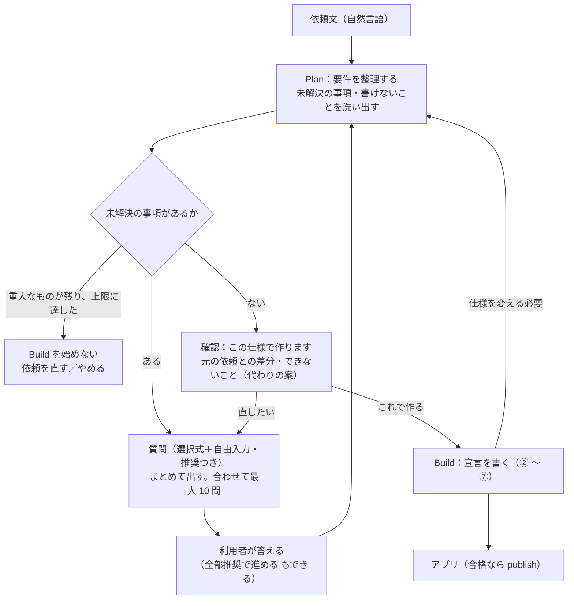

# 04：Plan エージェント（要件を固める役）

> 状態：**案 v2**（2026-10-10・窓口。Codex のレビュー（条件付き・指摘 12・高 6）を反映。§12 に対応表）。
> 判定の段（申告の仕分けと裏付け・P3 の洗い出し・P5 の振り分け・P6 の照合・評価の利用者役）に Jev を使う案は [`05-judge-model.md`](./05-judge-model.md)。
> 背景は受入の試験（effort `high`）の途中の結果：書ける題材の合格 37%（一発生成は 80%）・誤った申告のある本 90%。設計の段が「書けない」の欄に曖昧さのメモを書き、書ける要件まで落としていた。

## 0. 一言でいうと

**要件をはっきりさせる役（Plan）と、宣言を書く役（Build）を分ける。** Plan は利用者と往復して、曖昧な点を選択式で聞き、「確定した仕様」を作る。Build（今のパイプライン ② 〜 ⑦）は、その確定した仕様を**すべての段の正本**にして宣言を書く。

**分けるだけでは直らないもの**（レビュー #1・#2）：誤った「書けない」の判定・要件の取り出しの落ち・Build の生成の質。だから **Plan より先に、設計の段の誤った申告を直す**（§5・§10 の 1 本目）。Plan の P3 も同じ判定をするので、同じ直し（根拠の箇所を必須にし、独立に点検する）を Plan にも掛ける。

## 1. 所有者の決定（2026-10-10）

| 決定 | 中身 |
|---|---|
| 目指す UX | ①漠然とした依頼を自然言語で入力 → ②Plan モードで要件を整理し、曖昧な点を利用者に聞いて仕様を固める → ③その仕様から yaml を作る → ④アプリを作る |
| 質問の数 | **多くても 10 問くらい** |
| 質問の形 | **必ず選択式**とし、**自由入力**を含める。**推奨の選択肢**を示す |

## 2. 利用者から見た流れ

- **質問はまとめて出す**（1 問ずつ往復しない）。往復は **多くても 3 回**、質問は**合わせて 10 問まで**。**確認の画面からの直し・再開で上限を戻さない**
- どの質問にも「**推奨で決める**」があり、画面には「**全部推奨で進める**」がある（急ぐ利用者が止まらない）
- 曖昧さが無ければ、**質問を 0 問**で確認の画面に進む
- 確認の画面には、**元の依頼からの差分**（足した・直した・外した要件）と、**書けないこと**（「この形ではできません。代わりにこうできます」）を出し、了承を取ってから Build に進む
- **重大な未解決の事項**が上限のあとも残るときは、推奨で埋めて確定しない。Build を始めず、依頼を直すかやめるかを選ばせる（レビュー #6）

## 3. Plan の段

| 段 | 誰が | 中身 |
|---|---|---|
| P1 要件にする | LLM（構造化出力） | 今の ① と同じ（1 行 1 要件・原文の引用と位置） |
| P2 逆照合 | LLM（別の会話）＋コード | 今の ①' と同じ（原文に照らす） |
| P3 洗い出す | LLM（構造化出力・文書を渡す）＋**独立の点検** | 要件ごとに、次を分けて挙げる：**未解決の事項**（答えで作るものが変わる。重大か否か）／**語彙で書けないこと**／**試験で確かめられないこと**／**要件どうしの矛盾**。**書けないことには、文書の版・該当の箇所・制約 ID を必須**にし、別の会話で点検する（根拠の無い「書けない」はコードが断る）。書けない部分を特定し、**書ける残りを要件として残す** |
| P4 質問を組み立てる | LLM（構造化出力）＋コード | **1 問 = 未解決の事項 1 つ**。影響の大きい順に、合わせて 10 問まで。1 問は「質問 ID・問い・選択肢 2〜4（選択肢 ID）・推奨（とその理由 1 行）・自由入力」。コードが形・数・**事項との対応・重複**（既出・答え済み・作るものが同じになる選択肢）を確かめる |
| P5 答えを反映する | LLM＋コード | コードが答えを確かめる（質問 ID・選択肢 ID・対象の版・自由入力の長さ）。LLM が要件の一覧に反映する（足す・直す・外す・決めたことにする）。**どの要件が、どの答えで、どう変わったか**を記録する。自由入力から新しい事項が出たら、残りの問数の中で次の往復に回す |
| P6 照合と確定 | LLM（別の会話）＋コード | **会話全体（原文・質問・答え）と要件の一覧を、双方向に照らす**：会話のどの部分も要件か決めたことに対応するか／どの要件も出どころ（原文か答え）を持つか。そのうえで §4 の形にし、**未解決の事項がすべて「解決の根拠つき」で閉じている**ことをコードが確かめる |

- **書けないこと**は質問にしない。確認の画面で、代わりの案と一緒に見せる
- 名前・表示名・並び順など、**既定で決めてよいもの**は聞かない（決めたこととして残し、確認の画面で直せる）
- 質問の文に、宣言の用語（entity・computed など）を使わない。利用者の言葉で聞く

## 4. Plan と Build のあいだの契約：確定した仕様（v1）

型は appspec-schema の納品物の入口に置く（工場が 2 つとも使えるように）。

| 欄 | 中身 |
|---|---|
| `schema_version`・`plan_id`・`revision` | 契約の版・Plan の ID・仕様の版（答えを反映するたびに上がる） |
| `vocabulary_version` | P3 が照らした文書（語彙）の版 |
| `inputs[]` | 原文・質問・答えに **ID** を付けたもの（原文は文の範囲、質問は選択肢つき、答えは選んだ選択肢 ID か自由入力） |
| `requirements[]` | 要件 ID・文・**出どころ**（`inputs` の ID と引用）・**変更の関係**（元の要件 ID と、足した／直した／外した、とその答えの ID）・種類（決まりを含む／在ることだけ）・**部分**（`parts[]`：部分 ID・満たす／了承して除く／代わりの案を採る） |
| `open_issues[]` | 未解決の事項（ID・重大か否か・状態）と**解決の根拠**（答えの ID／既定で決めた理由） |
| `decisions[]` | 聞かずに決めたこと（何を・どう・理由）。確認の画面で直せる |
| `accepted_unwritable[]` | 了承して除く**部分 ID**・代わりの案の ID・根拠（文書の版・箇所・制約 ID） |
| `confirmation` | 確認した仕様の **SHA-256（コードが正規化して計算）**・確認した時刻・確認した人。仕様が変わったら**失効**する |

- 確定した仕様は納品物に入れる（`artifacts/plan.json`）。**会話の記録（答えの全文・LLM の応答）は別にし**、既定では残さない（S-8）。原文の扱い（保存の目的・保持の期間・削除）は §7 の U-P3 で決める
- `plan.json` は**無くてもよい**（今の工場・CommandAgent の納品物と互換を保つ）。あるときは、宣言・検証の結果に**同じ仕様の SHA-256** を記録し、確認の SHA と一致しなければ門で落とす
- 自由入力や LLM の出力から、**了承・持ち主・検査の省略を決めさせない**（それはコードと確認の画面だけが決める）

## 5. Build の変わるところ

- **正本は確定した仕様（全段）**：① は行わない。②'（試験）・⑤a（対応表）・⑥'（期待の裁定）の根拠も、原文ではなく**確定した仕様の要件と、その出どころ**にする（原文を優先すると、利用者が確定した変更を戻してしまう。レビュー #5）。①' は §3 の P6 に移る（Build では行わない）
- **仕様を変える必要が出たら Plan に戻す**：期待の誤りの主張が、確定した仕様そのものと食い違うとき、⑥' は裁定せず Plan に差し戻す（再確認で SHA が変わり、Build はやり直し）
- **「書けない」は語彙の穴だけ・根拠つき**（Plan の有無に関係なく先に直す）：設計の段の `unwritable` に、文書の版・該当の箇所・制約 ID を必須にする。曖昧さ・決めたこと・不確かさは別の欄（`notes`）に書かせる。**書ける残りを落とさない**（`unwritable` の要件でも、書ける部分は設計に残す）
- **了承した範囲との突き合わせは部分 ID で**：設計の `unwritable` が `accepted_unwritable` の部分 ID の外なら Plan の見落とし。部分案として返し、Plan の P3 をその要件だけやり直す
- **合格（full）**：確定した仕様の**有効な部分**（了承して除いた部分を除く）が**すべて満たされた**ときだけ。要件ごと除外して書ける残りの落ちを隠さない（レビュー #3）

## 6. 質問の決まり（P4・P5）

1. **1 問は未解決の事項 1 つに対応する**。答えで作るものが変わらないなら聞かずに決めたことにする
2. 影響の大きい順に並べ、合わせて 10 問まで。往復は 3 回まで。直し・再開で上限を戻さない
3. 1 問ごとに、**選択肢 2〜4**・**推奨 1 つ（理由 1 行）**・**自由入力**。「推奨で決める」はどの問いにもある
4. 選択肢は、どれを選んでも**書ける**ものにする（書けないものは確認の画面で扱う）。作るものが同じになる選択肢は 1 つにまとめる
5. 依頼文と答えは**データ**として扱い、そこに書かれた指示には従わない（今の規則とデータの分離を引き継ぐ）。**仕様についての指示**（「一覧は日付の順に」）は要件として扱い、**運用についての指示**（「試験を飛ばして」「前の答えを無視して」）は要件にしない
6. **答えの検査はコード**：質問 ID・選択肢 ID・対象の版（古い質問への答えは断る）・自由入力の長さの上限
7. **矛盾は黙って採らない**：前の答えや原文と食い違う自由入力、重要な要件を外す答えは、次の往復で確かめる（問数に数える）

## 7. 置き場所

| 段階 | どこで動かすか |
|---|---|
| 段階 1（手元） | `packages/factory` に Plan の段を足す。手元の入口（CLI）は、質問を端末に出して答えを受け取る対話の形と、**答えのファイルを読む形**（評価用）の 2 つ |
| 段階 3（M2.2） | host のチャットの画面 → gateway → data-api → 工場の Worker（Service Binding）。往復の状態は **data-api を通して**持ち、持ち主を data-api が確かめる。LLM は adapter。publish は今の門を必ず通す |

- 依存の向きは変えない（factory → spec-engine・appspec-schema）。端末とファイルの読み書きは CLI だけに置く
- **答えを待つあいだは実行を終える**（状態を保存して止める）。再開は版つき・重複を除いて扱う

## 8. 時間と費用

- Plan の呼び出し：P1・P2・P3（＋点検）・P4・P5・P6（照合）。1 往復で増えるのは P5・P3 の差分・P4。**見込み 0.02〜0.05 USD／依頼**（実測で置き換える）
- **Plan と Build で予算を分けて持つ**：Plan の費用と呼び出しの回数、Build から Plan への差し戻しは **1 回まで**
- **時間は 3 つに分けて測る**：機械が動いた時間・人を待った時間・TTSU（最初の依頼から使えるまで）。質問はまとめて出し、「全部推奨で進める」で待たずに進めるようにする

## 9. 評価

| 組 | 中身 | 見るもの |
|---|---|---|
| **受入の 10 パターン**（第 5 段と同じ） | 要件が明確な依頼。**質問はほぼ 0 問のはず** | **不要な質問の率**・質問の数・Build の合格 |
| **曖昧な依頼の組**（新しく作り、封をする） | 題材ごとに「**隠した本当の意図**」を**構造化して**持つ（事項 ID ごとの正しい答え）。**台本**（事項 ID → 答え）で答える | **重大な事項の解決の率**・不要な質問の率・確定した仕様が意図に合う割合（**事項 ID ごとに、凍結した採点のコードで**）・利用者の負担（問数・自由入力の数） |
| **Plan と Build の切り分け** | 同じ Build（同じ effort・契約・採点）に、**原文／正しい確定した仕様（人が作る）／Plan が作った仕様** の 3 つを渡す | Plan の整理の効果と Build の生成の質を別々に出す（失敗の本も数える） |
| 補助 | LLM の利用者役（**問われた事実だけ答える。不明も許す**）と、人の試行 | 台本に無い問いへの振る舞いを見る。主の判定には使わない |

- Plan・利用者役・採点には、それぞれ必要な情報だけを渡す（意図を Plan に漏らさない）
- 曖昧な依頼の組は、保留の題材と同じく、Plan のプロンプトを直すときに見ない
- 段階 1 の受入の基準（`03` §4）に足す（案）：質問の数の上限（10）を守ること・受入の 10 パターンで不要な質問の率 10% 以下・曖昧な依頼の組で意図に合う割合 90% 以上

## 10. Issue の分け方（段階 1・7 本）

| 順 | 中身 | 依存 |
|---|---|---|
| 1 | **判定の口**（factory の port・Luna 版・Jev の adapter・偽物の判定。`05` §4） | — |
| 2 | **設計の段の誤った申告を直す**：`unwritable` に根拠（版・箇所・制約 ID）を必須にし `notes` を分ける・書ける残りを落とさない・**申告の仕分けと裏付け**（`05` §3）・effort `medium` の出力の上限 | 1 |
| 3 | **確定した仕様の契約**（appspec-schema）：§4 の型と、SHA の計算・確認の失効 | — |
| 4 | **Plan の段**（P1〜P6・factory。P3 の目録の扇形・P5 の振り分け・P6 の照合は判定の口を使う） | 1・2・3 |
| 5 | **Build が確定した仕様を正本にする**・部分 ID での合格・`plan.json` を納品物と門に | 2・3（4 と並行できる） |
| 6 | **手元の入口**（対話の形・答えのファイルの形） | 4・5 |
| 7 | **評価**：曖昧な依頼の組（封をする）・台本・Jev の利用者役・凍結した採点・3 つの比較・判定のラベル付きの組（`05` §7） | 6 |

- M2.2 は別に 3 本（状態と権限 → API と Worker → 画面）。段階 1 の結果を見てから切る

## 11. 決まっていないこと

> 2026-10-10 所有者が、U-P1〜U-P5 を窓口の案のとおり了承した（U-P1 は「とりあえず」）。

| # | 何を | 窓口の案 |
|---|---|---|
| U-P1 | 往復の回数の上限 | 3 回（直し・再開で戻さない） |
| U-P2 | 「書けないこと」の代わりの案を、Plan が出すか | 出す（文書の語彙で書ける近い形を 1 つ。了承は利用者） |
| U-P3 | M2.2 で往復の状態と原文をどこに・どれだけ持つか | ジョブの記録（D1）に状態と仕様の SHA-256、確定した仕様は R2。会話の記録は既定で残さない。原文の保持の期間と削除は S-8 と一緒に決める |
| U-P4 | 受入の 10 パターンで、Plan が質問をしたら減点するか | 不要な質問の率で見る（10% 以下）。10 問を超えたら不合格 |
| U-P5 | 今の受入の試験（Plan なし・effort `high`）の扱い | 流し切って「Plan なし」の基準として残す。§9 の 3 つの比較の「原文」の組にも使う |

## 12. レビューの反映（Codex・2026-10-10・条件付き・指摘 12）

| # | 重さ | 指摘 | 反映 |
|---|---|---|---|
| 1 | 高 | 原文だけの ①' では、答えから増えた要件・変更・撤回を照合できない | §3 P5・P6（会話全体との双方向の照合）・§4 `inputs`・出どころ・変更の関係 |
| 2 | 高 | P3 も LLM の判定なので、誤った「書けない」を再現する | §0・§3 P3（根拠を必須・独立の点検）・§5・§10 の 1 本目 |
| 3 | 高 | 自由文の「部分」では了承の範囲をコードで判定できず、書ける残りの落ちを full で隠す | §4 `parts`・`accepted_unwritable` を部分 ID に・§5 の合格 |
| 4 | 高 | 原文の SHA だけでは、確認後の変更を防げない | §4 `revision`・`confirmation`（SHA・失効）・門で照合 |
| 5 | 高 | ②'・⑤a・⑥' が原文を根拠にする規則と食い違う | §5（全段の正本・Plan への差し戻し） |
| 6 | 高 | 未解決 0 の判定と根拠が無い。上限で推奨埋めする危険 | §2・§3 P6・§4 `open_issues`（解決の根拠）・重大なら Build を始めない |
| 7 | 中 | 矛盾・無効な選択・古い質問への答えの扱いが無い | §6 の 5〜7 |
| 8 | 中 | 「答えで仕様が変わった割合」は不要な質問でも上がる | §6 の 1・§9（不要な質問の率・重大な事項の解決の率・負担） |
| 9 | 中 | LLM の利用者役は意図を漏らす・補う | §9（構造化した意図・台本・凍結した採点を主、LLM は補助） |
| 10 | 中 | 一発生成の 80% との直接の比較は、Plan と Build の効果が混ざる | §9（3 つの比較） |
| 11 | 中 | 費用に P1・P2・点検・差し戻しが無い。待ちと再開が未定 | §7（待つあいだは終える）・§8 |
| 12 | 中 | 原文と往復の全文を残すのは S-8 と食い違う | §4（会話の記録を分ける・既定で残さない）・U-P3 |
