# MUSUNEST ロードマップ

> 状態：**決定**（2026-09-16 所有者が決定）。所有者の方針「ロードマップを描いて、アジャイルに進める」を受けて 2026-09-15 に案として整理した。GitHub の Milestone も §8 のとおり作り直した。
> 出典：企画書 v3.2 の 15章（MVP）／22章（ロードマップ）。**ここには章番号だけを書き、内容を引き写さない。**
> **マイルストーンの一覧の正本はこの文書である。** 各マイルストーンの詳しい整理は [`m0/`](./m0/README.md)・[`m1/`](./m1/README.md) にある。

---

## 0. 目指す体験

**スマホで「こんなアプリがほしい」と伝えると、数分でアプリができて、そのまま仲間と使える。**
利用者から見た流れは [`m1/README.md`](./m1/README.md) §0.1 のユーザーシナリオにある。

---

## 1. 進め方の決まりごと

| 決まりごと | 中身 |
|---|---|
| **1 マイルストーン＝1 つの「できること」** | 利用者（まずは所有者）から見て、何ができるようになったかで区切る。技術の部品（schema・data-api…）では区切らない |
| **終わったら、デモと振り返り** | スマホで実際に動かして見せる。何がうまくいき、何を学んだかを 5 行で残す |
| **詳しく計画するのは「今」と「次」だけ** | Issue を切るのは、今と次のマイルストーンだけ。その先は「できること」と「デモ」の 1 行だけ書いておく |
| **期限は置かない** | 着手日と完了日を記録し、次の計画の見積もりに使う（M1 の決定。`m1/00-open-questions.md` Q10） |
| **学んだら、ロードマップを直す** | 順番や分け方は、デモのたびに見直してよい。直すときはこの文書を PR で更新する |
| **ゲートは守る** | 企画書のゲート（事前宣言 → 実測 → 清算）は変えない。ゲートは、いくつかのマイルストーンのまとまりの終わりに置く |

---

## 2. 全体図

```mermaid
flowchart LR
  M0["M0<br/>開発基盤<br/>✅ 完了"]

  subgraph P1["M1：宣言からアプリを動かす"]
    M11["M1.1<br/>宣言から<br/>フォームと一覧が出る"] --> M12["M1.2<br/>割り勘の<br/>精算が出る"]
    M12 --> M13["M1.3<br/>タスク管理が<br/>動く"]
    M13 --> M14["M1.4<br/>ダッシュボードが<br/>動く"]
    M14 --> M15["M1.5<br/>契約を固めて<br/>工場に渡せる"]
    M15 --> G1A{{"M1a ゲート"}}
    G1A --> M16["M1.6<br/>工場が作った<br/>アプリが動く"]
    M16 --> G1B{{"M1b ゲート"}}
  end

  subgraph P2["M2：MVP コア"]
    M21["M2.1<br/>ログインして<br/>自分のアプリが見える"] --> M22["M2.2<br/>指示すると<br/>アプリができる"]
    M22 --> M23["M2.3<br/>仲間を招待して<br/>一緒に使える"]
    M23 --> M24["M2.4<br/>追加の指示で<br/>同じリンクのまま直る"]
    M24 --> M25["M2.5<br/>10 分で届くかを<br/>測る"]
    M25 --> G2{{"M2 ゲート<br/>TTSU ≤ 10 分"}}
  end

  subgraph LATER["その先（近づいたら分ける）"]
    M3["M3<br/>ドッグフーディング"] --> M4["M4<br/>クローズドβ → 公開"] --> M5["M5<br/>マネタイズ"] --> M6["M6<br/>Organizer 層・EXT"] --> M7["M7<br/>エコシステム"]
  end

  M0 --> M11
  G1B --> M21
  G2 --> M3
```

---

## 3. 今・次・その先

| 区分 | マイルストーン | Issue |
|---|---|---|
| ~~完了~~ | **M1.1 宣言からフォームと一覧が出る**（2026-09-17 合格。デモの記録は [`m1/demos.md`](./m1/demos.md)） | #96〜#105 すべて CLOSED |
| ~~完了~~ | **M1.2 割り勘の精算が出る**（2026-09-18 合格。デモの記録は [`m1/demos.md`](./m1/demos.md)） | #106〜#112。途中で #142・#145・#150・#152 を足した |
| ~~完了~~ | **M1.3 タスク管理が動く**（2026-09-19 合格。デモの記録は [`m1/demos.md`](./m1/demos.md)） | #154〜#160。あわせて #167・#168・#169 を足した |
| ~~完了~~ | **M1.4 ダッシュボードが動く**（2026-09-23 合格。デモの記録は [`m1/demos.md`](./m1/demos.md)） | #175〜#184。途中で #188 を足し、デモで見つかった欠陥の直しに #200・#201・#202・#204 を足した |
| **今** | **M1.5 契約を固めて、工場に渡せる** | まだ切っていない。**式の文法の明文化と AI の検証**（#168）・静的チェックの上限値・「画面の参照」の残りがここに入る（材料は [`m1/demos.md`](./m1/demos.md) の M1.4「残っていること」） |
| **次** | M1.6 工場（CommandAgent）が作ったアプリが動く | M1.5 の途中で切る |
| その先 | M2.1〜M2.5、M3〜M7 | まだ切らない |

---

## 4. M1：宣言からアプリを動かす

企画書 22 章の M1 を、6 つのマイルストーンに分けた。進め方の考え方は [`m1/01-integration-strategy.md`](./m1/01-integration-strategy.md)、見本の中身は [`m1/02-l2-spec-examples.md`](./m1/02-l2-spec-examples.md) にある。

| # | できるようになること | スマホで見せるデモ | 主な中身 |
|---|---|---|---|
| **M1.1** | **手で書いた宣言を置くと、アプリの画面が出て、入力が保存される** | 支出を 2 件入れると一覧に出て、1 人あたりの額が出る。再読み込みしても、PC で開いても残っている | **v0.1 と同じ語彙**（entity と項目・一覧・追加・入力の検査・同じ entity の中の計算）の型と静的チェック、publish、D1 への登録、data-api の読み書き、DO への保存、gateway・host の中継、画面（フォームと一覧）。production では API を閉じる |
| **M1.2** | **割り勘の精算が出る** | 夕食 6,000 円・タクシー 3,000 円を入れると「C さん → A さん 3,000 円」と出る | メンバーと参照、集計、精算の関数、端数の決めごと、直す・消す、入力の検査の文言、データ層・ロジック層の静的チェック、採点のシナリオのテスト（時計を差し込む）と staging の e2e（`deploy-staging` の貫通スモークのあと）、`/api` の CPU 時間の実測（`m0/06-plan-and-limits.md` §5 の P-7 で判定） |
| **M1.3** | **タスク管理が動く** | 期限切れのタスクが赤くなり、「完了にする」を押すと列が移る | 選択肢・日付・「今日」（日本時間。採点は時計を差し込んだテストで行う）、状態の書き換えと操作の条件、ボード・絞り込み・強調 |
| **M1.4** | **ダッシュボードが動く** | 活動を記録すると、今月の回数とグラフが変わる | アプリ全体の集計、月ごと・種類ごとの集計、平均の表示、数値・棒・円・順位の部品 |
| **M1.5** | **契約を固めて、工場に渡せる** | わざと壊した宣言を静的チェックにかけると、どこが悪いかが日本語で出る。3 つの見本がスマホで動く | 静的チェックの残り（層の向き・守りの置き場所・画面の参照・上限）、**式の文法の明文化（文法の正本。#168・Q19）**、スキーマ v0.2 の確定、実行時の意味の文書、`pins/` の差し替え、テンプレート（#38） |
| **M1.6** | **工場（CommandAgent）が作ったアプリが動く** | CommandAgent に頼んで作った割り勘が、見本と同じ「C さん → A さん 3,000 円」を出す | 工場側：スキーマとテンプレートの差し替え、profile・intent の調整、golden の再封緘。こちら側：headless 契約の読み取り、再検証の再現、見本と生成物の比較 |

### 4.1 M1 のゲート

| ゲート | 置き場所 | 中身（正本は `m1/01-integration-strategy.md` §5.3） |
|---|---|---|
| **M1a** | M1.5 の終わり | 手書きの見本 3 つが staging のスマホで動き、契約の正本とピンが揃う |
| **M1b** | M1.6 の終わり | 工場が新しい契約で作った 3 つのアプリが、見本と同じ値を出す |

### 4.2 M1.1 を「フォームと一覧だけ」にした理由

- M1 で一番危ないのは、**Worker をまたぐ経路（置く → 読む → 保存する → 画面に出す）が本当に通るか**である。これを最初に、一番小さなアプリで通す
- 精算・集計・静的チェックの全部を最初に入れると、デモまでが遠くなり、途中で何が動いたかが見えない
- 支出だけの小さなアプリでも、**スマホで入力して、再読み込みしても残る**ところまで見せられる
- 語彙は、見本が必要とする分だけマイルストーンごとに足す。足し方は [`m1/04-spec-evolution.md`](./m1/04-spec-evolution.md) にある

---

## 5. M2：MVP コア

企画書 15 章の MVP と 22 章の M2 を、ユーザーシナリオ（`m1/README.md` §0.1）の順に 5 つに分けた。**M1 が終わったら詳しく分け直す。**

| # | できるようになること | スマホで見せるデモ（シナリオの手順） | 主な中身 |
|---|---|---|---|
| **M2.1** | **ログインして、自分のアプリの一覧が見える** | Google でログインすると、ホームに自分のアプリが並ぶ（手順 1） | Google OAuth（LINE の中のブラウザからは外のブラウザへ移す）、Community の自動作成、アプリの持ち主、production でアプリを開けるようにする |
| **M2.2** | **指示すると、数分でアプリができる** | 「旅行の割り勘アプリがほしい」と入れると、進み具合が出て、数分で開ける（手順 2〜4） | 指示の画面、Queue、工場の自動起動（連携 Lv2）、修復が尽きたときの昇格、自動の publish、「できました」の通知 |
| **M2.3** | **仲間を招待して、一緒に使える** | LINE で送ったリンクから、B さんがログインせずに名前を選んで参加し、入力がすぐ相手の画面に出る（手順 5〜7） | 招待リンク、ゲスト参加（スロット）、メンバーだけが開ける権限、リアルタイム同期 |
| **M2.4** | **追加の指示で、同じリンクのままアプリが直る** | 「メモ欄を足して」と頼むと、同じリンクのまま新しくなり、入力済みのデータが残る（手順 9） | 同じリンクのままの差し替え（Progressive Delivery）、前の版との互換チェック |
| **M2.5** | **指示から 2 人目が使うまでを測って、10 分以内を示す** | 計測の画面で、指示から 2 人目の利用までの時間（TTSU）が見える | TTSU のファネル、失敗の帰属分類ログ、PWA |

- **M2 のゲート**：自分たちで、TTSU ≤ 10 分を連続で達成する（企画書 22 章）。M2.5 の終わりに置く
- **M2.2 の前に決めること**：工場（CommandAgent）を**どこで自動で動かすか**。今は所有者の手元で動かしている。自動で起動するには、動かす場所・API キーの置き場所・生成の費用の上限を決める必要がある

---

## 6. その先（M3〜M7）

近づいたら、M1・M2 と同じように「できること」の単位に分ける。今は企画書 22 章のまとまりのまま置く。

| # | まとまり | ゲート |
|---|---|---|
| M3 | ドッグフーディング（身近な実コミュニティで使ってもらう） | 市場ゲート（企画書 22 章。着手前に判定線を宣言する） |
| M4 | クローズドβ → 公開 | — |
| M5 | マネタイズ | 企画書 22 章 |
| M6 | Organizer 層・EXT（Connector Plane） | 企画書 22 章 |
| M7 | エコシステム（Form B・テンプレートマーケット） | — |

---

## 7. 企画書との違い

| 違い | 扱い |
|---|---|
| 企画書の M1 は 1 つ。ここでは **M1.1〜M1.6 に分けた** | 企画書の M1 の完了条件は、M1.5（配信）と M1.6（連携 Lv1）で満たす |
| 企画書の M1 は「封緘済み golden を先に動かす」順番 | 手書きの見本を先に動かす順番に変えた（`m1/01-integration-strategy.md`。2026-09-15 所有者が決定） |
| 企画書の MVP の 3 アプリ（持ち物・割り勘・投票）と、M1 の見本（割り勘・タスク管理・ダッシュボード）が違う | 見本は契約を固めるための題材である。**M3 で実コミュニティに入れるアプリは、M3 の前に決め直す** |
| 企画書は M2 の中身を 1 つのまとまりで書いている | ユーザーシナリオの順に M2.1〜M2.5 に分けた |

---

## 8. GitHub での管理（2026-09-16 実施）

### 8.1 Milestone

- M1.1〜M1.6 と M2.1〜M2.5 を、GitHub の Milestone として作った（名前は「M1.1 宣言からフォームと一覧が出る」のようにした）
- Milestone `M1`・`M2` は、中の Issue を移したあとで閉じた。`M3` は、M3 を分けるまで残す

### 8.2 Issue の置き場所

| Issue | 元 | 移した先 | 理由 |
|---|---|---|---|
| #38 テンプレート tarball の SHA-256 | M1 | **M1.5** | テンプレートは契約を固めるときに作る |
| #19 🧑 商標クリアランスの発注 | M1 | **M3**（実コミュニティで名前を出す前） | 開発の作業とは独立している。名前を外に出す前に済ませる |
| #23 🧑 Google Cloud OAuth クライアント | M2 | **M2.1** | ログインで使う |
| #22 🧑 LINE Developers dev チャネル | なし | **未定**（LINE Login の要望が出たら） | 企画書 15 章で、LINE Login は要望が出てから |
| #27 promotion_decision の記録件数 | M2 | **M2.5** | 計測の画面に入れる |
| #28 🧑 CI トークンを最小構成へ | M3 | M3 のまま | 実データが乗る前に締める |
